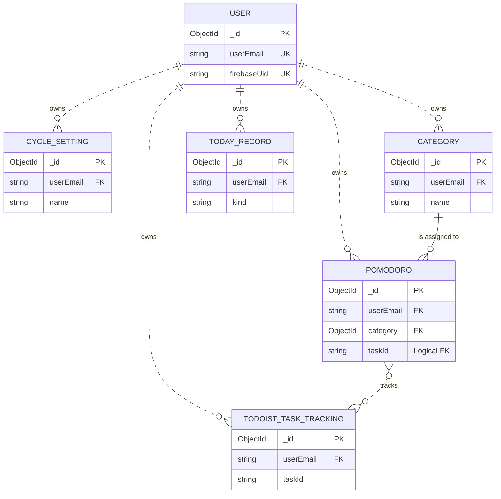

# Data Structure

## Database ERD

```mermaid
erDiagram
    USER {
        ObjectId _id "PK"
        string userEmail "UK"
        string firebaseUid "UK"
    }

    CYCLE_SETTING {
        ObjectId _id "PK"
        string userEmail "FK"
        string name
    }

    CATEGORY {
        ObjectId _id "PK"
        string userEmail "FK"
        string name
    }

    POMODORO {
        ObjectId _id "PK"
        string userEmail "FK"
        ObjectId category "FK"
        string taskId "Logical FK"
    }

    TODAY_RECORD {
        ObjectId _id "PK"
        string userEmail "FK"
        string kind
    }

    TODOIST_TASK_TRACKING {
        ObjectId _id "PK"
        string userEmail "FK"
        string taskId
    }

    %% --- 관계 정의 ---
    %% 한 명의 USER는 여러 데이터를 '소유'합니다. (논리적 관계: userEmail)
    USER ||..o{ CYCLE_SETTING : "owns"
    USER ||..o{ CATEGORY : "owns"
    USER ||..o{ POMODORO : "owns"
    USER ||..o{ TODAY_RECORD : "owns"
    USER ||..o{ TODOIST_TASK_TRACKING : "owns"

    %% 한 개의 CATEGORY는 여러 POMODORO에 '할당될' 수 있습니다. (물리적 관계: ref)
    CATEGORY ||--o{ POMODORO : "is assigned to"

    %% POMODORO와 TODOIST_TASK_TRACKING은 taskId로 연결됩니다. (기능적 관계)
    POMODORO }o..o{ TODOIST_TASK_TRACKING : "tracks"
```
{/* ## Key Sequence Diagrams */}

