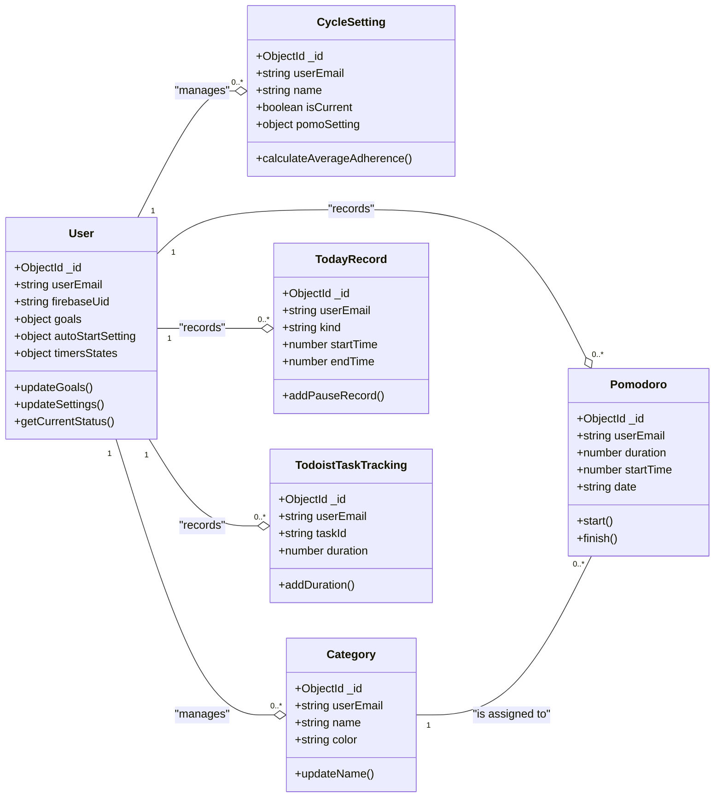

# Architecture & Design

{/* ## C3: Component (필요한 컨테이너별로) */}
{/* ## UML Class Diagram

```mermaid
classDiagram
    direction LR

    class User {
        +ObjectId _id
        +string userEmail
        +string firebaseUid
        +object goals
        +object autoStartSetting
        +object timersStates
        +updateGoals()
        +updateSettings()
        +getCurrentStatus()
    }

    class CycleSetting {
        +ObjectId _id
        +string userEmail
        +string name
        +boolean isCurrent
        +object pomoSetting
        +calculateAverageAdherence()
    }

    class Category {
        +ObjectId _id
        +string userEmail
        +string name
        +string color
        +updateName()
    }

    class Pomodoro {
        +ObjectId _id
        +string userEmail
        +number duration
        +number startTime
        +string date
        +start()
        +finish()
    }

    class TodayRecord {
        +ObjectId _id
        +string userEmail
        +string kind
        +number startTime
        +number endTime
        +addPauseRecord()
    }

    class TodoistTaskTracking {
        +ObjectId _id
        +string userEmail
        +string taskId
        +number duration
        +addDuration()
    }

    %% --- 관계 정의 (Relationships) ---
    %% User는 여러 객체를 소유하거나 관리하는 중심적인 역할을 합니다.
    %% '1'은 한 명의 User를, '*'는 여러 개를 의미합니다.
    User "1" --o "0..*" CycleSetting : "manages"
    User "1" --o "0..*" Category : "manages"
    User "1" --o "0..*" Pomodoro : "records"
    User "1" --o "0..*" TodayRecord : "records"
    User "1" --o "0..*" TodoistTaskTracking : "records"

    %% Category와 Pomodoro의 관계
    %% '1'은 하나의 Category를, '0..*'는 0개 또는 여러 개의 Pomodoro를 의미합니다.
    Category "1" -- "0..*" Pomodoro : "is assigned to"
``` */}

## Database ERD

```mermaid
erDiagram
    USER {
        ObjectId _id "PK"
        string userEmail "UK"
        string firebaseUid "UK"
    }

    CYCLE_SETTING {
        ObjectId _id "PK"
        string userEmail "FK"
        string name
    }

    CATEGORY {
        ObjectId _id "PK"
        string userEmail "FK"
        string name
    }

    POMODORO {
        ObjectId _id "PK"
        string userEmail "FK"
        ObjectId category "FK"
        string taskId "Logical FK"
    }

    TODAY_RECORD {
        ObjectId _id "PK"
        string userEmail "FK"
        string kind
    }

    TODOIST_TASK_TRACKING {
        ObjectId _id "PK"
        string userEmail "FK"
        string taskId
    }

    %% --- 관계 정의 ---
    %% 한 명의 USER는 여러 데이터를 '소유'합니다. (논리적 관계: userEmail)
    USER ||..o{ CYCLE_SETTING : "owns"
    USER ||..o{ CATEGORY : "owns"
    USER ||..o{ POMODORO : "owns"
    USER ||..o{ TODAY_RECORD : "owns"
    USER ||..o{ TODOIST_TASK_TRACKING : "owns"

    %% 한 개의 CATEGORY는 여러 POMODORO에 '할당될' 수 있습니다. (물리적 관계: ref)
    CATEGORY ||--o{ POMODORO : "is assigned to"

    %% POMODORO와 TODOIST_TASK_TRACKING은 taskId로 연결됩니다. (기능적 관계)
    POMODORO }o..o{ TODOIST_TASK_TRACKING : "tracks"
```
{/* ## Key Sequence Diagrams */}

