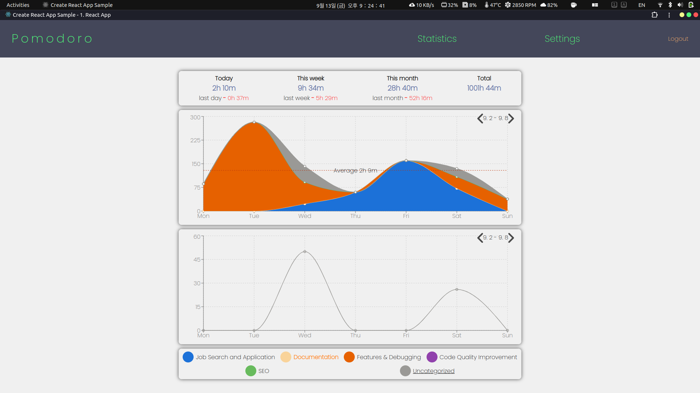
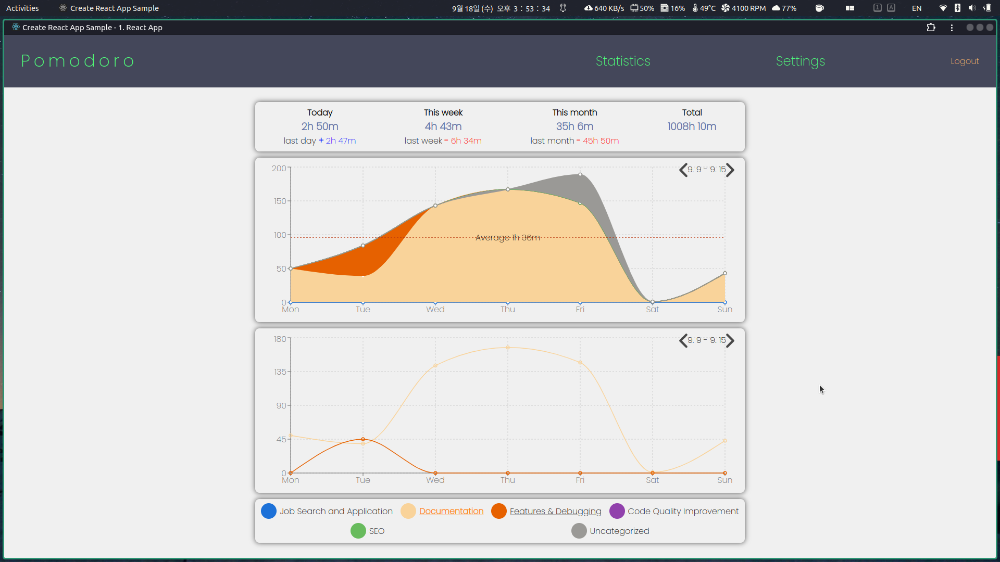
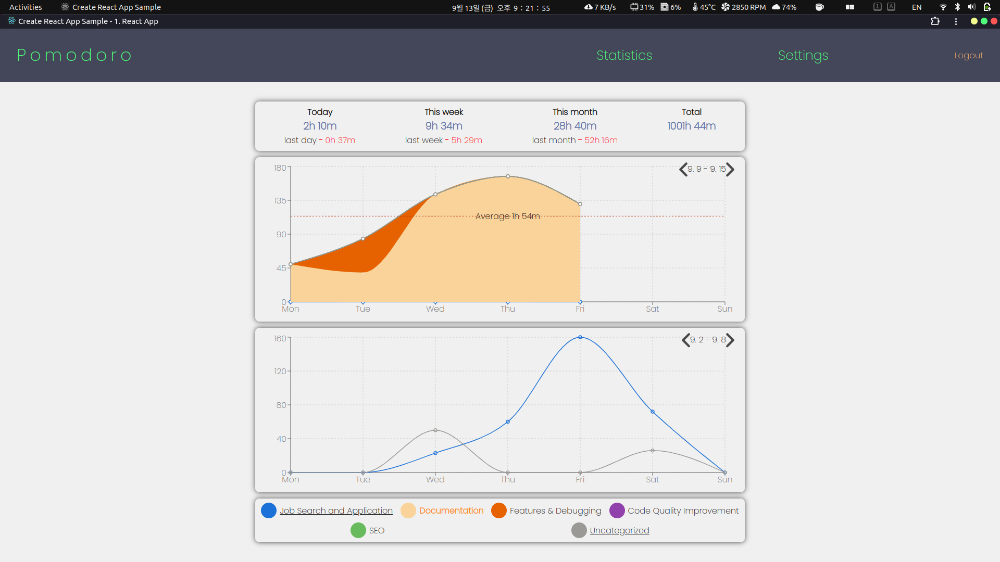
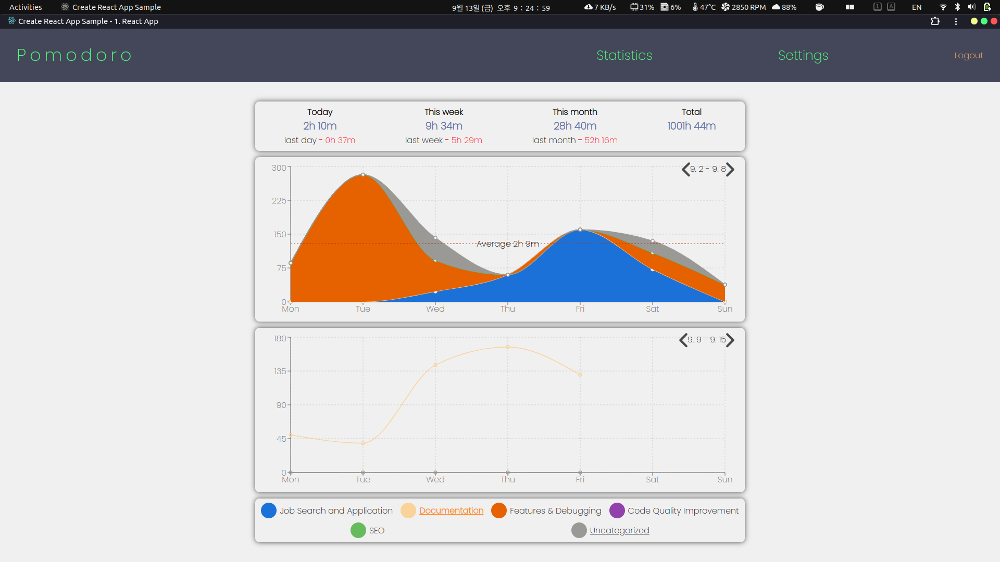
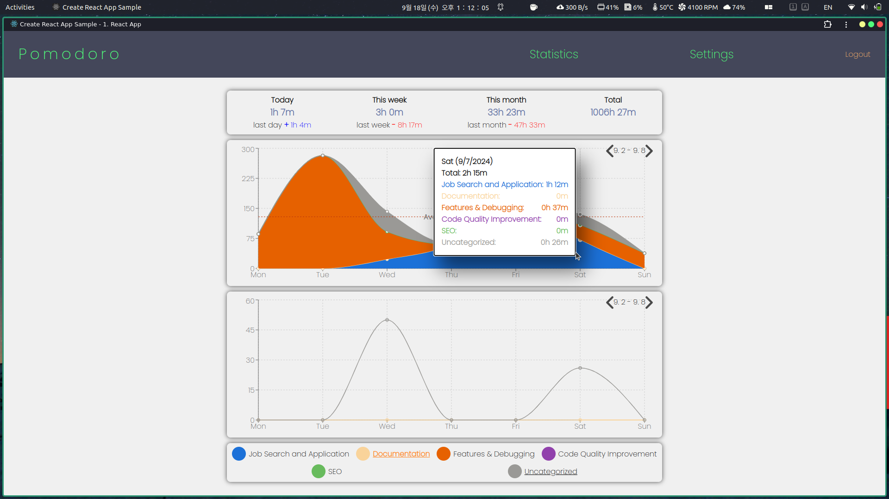
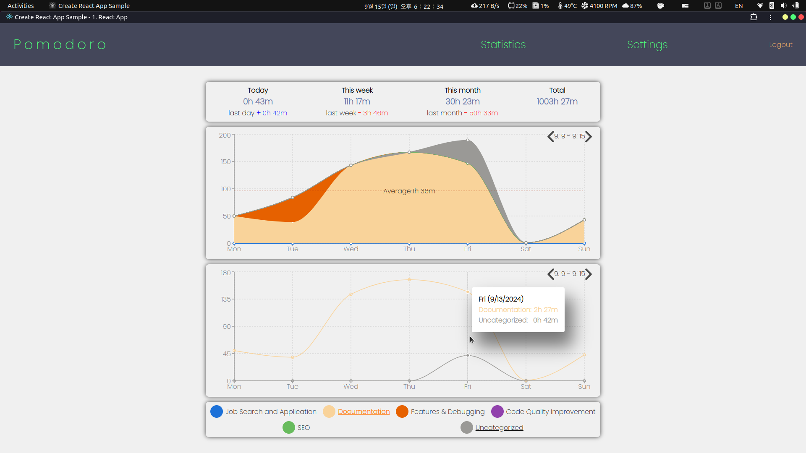
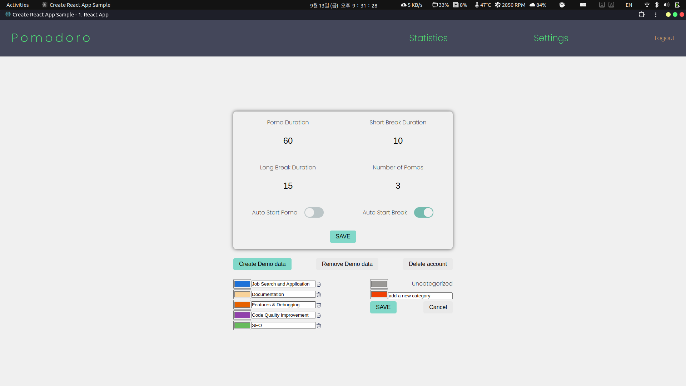
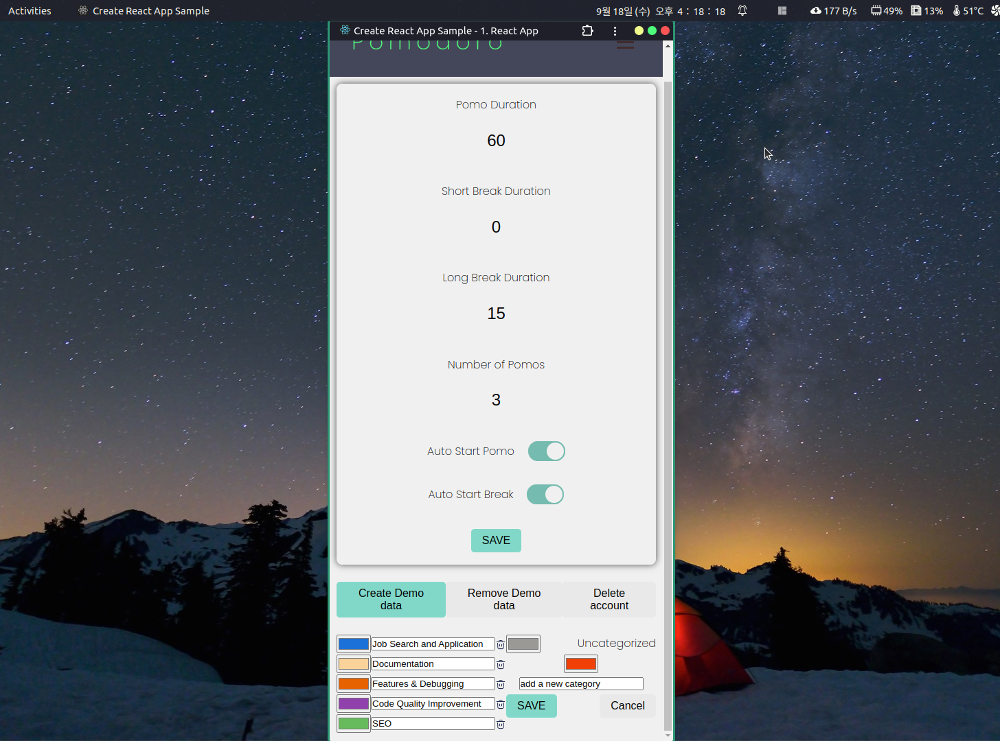

# Pomodoro Timer

## 개념

[pomodoro technique](https://ko.wikipedia.org/wiki/%ED%8F%AC%EB%AA%A8%EB%8F%84%EB%A1%9C_%EA%B8%B0%EB%B2%95)을 기반으로 하는 공부 & 작업 시간 측정 App입니다. 한 사이클의 작업 시간을 여러 개의 작업 세션들과 그에 뒤따르는 짧은 휴식 그리고 다음 사이클 시작 전의 마지막 긴 휴식으로 나누어 높은 집중력을 유지하는 데 도움을 줍니다.
(작업 시간을 pomodoro 또는 pomo라고 부릅니다).

`One cycle == (pomo + short break) * number of pomos + long break`

## 만들게 된 계기

원래 사용하던 앱이 있었는데, 일시 정지를 한 번 했을 때 얼마 동안 했는지 기록이 안 되어서, 그것을 계기로 내가 원하는 기능들을 추가하면서 배워보자는 생각으로 만들기 시작했습니다.

## 기술 스택

### 프론트엔드

- React(with TypeScript), React Router DOM, Axios, Firebase Authentication, Styled Components

### 백엔드

- NestJS, Express (구 서버), Firebase Admin, MongoDB Atlas, Mongoose

### 호스팅

- Vercel - React app
- Render.com - API server

## 기능 요약

- 포모도로와 휴식으로 구성된 한 사이클에 대한 설정 및 각 세션의 측정
- 타임라인을 통해 시각적 피드백 제공
- 자동 시작
- Statistics 페이지에서 주간 통계 제공
- 세션을 구분하기 위한 카테고리 생성
- 카테고리별 통계
- 일시 정지 및 정지한 시간 측정
  - 한 세션에서 한 일시 정지들을 타임라인에 그려서 피드백 제공
- 세션 진행 도중 `/timer`, `/statistics`, 그리고 `/settings` 페이지 간 자유롭게 이동 가능

## 아키텍처

## Page Screenshots

아래는 각 페이지의 간단한 스크린샷이며, 구체적인 기능 설명은 다음 섹션인 'Features'에서 다루겠습니다.

### `/timer`

세션 진행 도중에 카테고리 바꾼 경우.

타임라인  

### `/statistics`

#### Total Graph and Category graph

두번째 그래프에 `uncategorized`만 그려짐.  

두번째 그래프에 `Documentation` 와 `Features & Debugging`.  

두번째 그래프에 `uncategorized` 와 `Job Search and Application`.  

#### Two graphs show different week data

첫번째 - `9.9 ~ 9.15`, 두번째 - `9.2 ~ 9.8`.  

첫번째 - `9.2 ~ 9.8`, 두번째 - `9.9 ~ 9.15`.  

#### Mouse hover over each graph

  

### `/settings`

  

