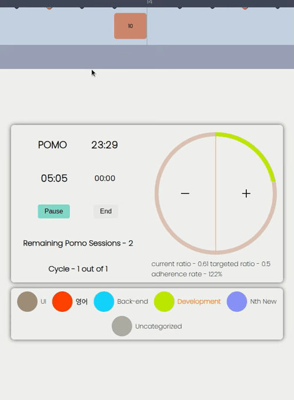

import ResponsivePlayer from "../src/components/ResponsivePlayer/ResponsivePlayer";
import Collapse from "../src/components/Collapse"
import { Highlight } from "../src/components/Highlight";

# Features

<Highlight>**초록색 글자는 YouTube 동영상이나 GitHub 이슈 링크입니다.**</Highlight> 

{/* ## sign-up and sign-in with google account */}

{/* <reactplayer playing={false} controls url="https://youtu.be/zjkvubfuuwi" /> */}

{/* ## Sign-up & in with Google Accounts */}


## Timer

### Time Countdown and Pause

[Pomodoro](https://youtu.be/NNqVZx9zpRI)와 [Break](https://youtu.be/4H3wQPCgWtA) 세션 모두 카운트다운 중에 일시정지할 수 있으며, 일시정지한 시간도 카운트됩니다.


### [Autostart](https://youtu.be/VdyeISbcLvQ)

- 한 사이클을 구성하는 Pomodoro와 Break에 대해 각각 자동 시작 여부를 설정할 수 있습니다.
  
  따라서 Pomodoro만 자동 시작하거나, Break만 자동 시작하거나, 둘 다 자동 시작하도록 설정할 수 있습니다.
- 다음 사이클이 자동으로 시작되도록 설정할 수 있습니다.
- `/timer` 뿐만 아니라 `/statistics`, `/settings` 페이지에서도 자동 시작이 가능합니다.

<ResponsivePlayer url="https://youtu.be/VdyeISbcLvQ" />

### [Notification and Click to Focus](https://youtu.be/5t8QwR4VwqM)

- 세션이 종료될 때, notification이 pop up 되고 그것을 클릭하면 focus가 웹앱으로 옮겨집니다.

<ResponsivePlayer url="https://youtu.be/5t8QwR4VwqM" />

### [Add and Subtract 5 minutes](https://youtu.be/IldF2Abr1q8)

- 세션 진행 도중 5분 단위로 유연하게 세션을 연장하거나 줄일 수 있습니다.

<ResponsivePlayer url="https://youtu.be/IldF2Abr1q8" />


### [Categorized Sessions](https://youtu.be/lBuaJb0g8lg)

- 원하는 카테고리를 이용해서 세션을 진행할 수 있습니다.
- 세션 진행 도중 카테고리의 이름이나 색상을 변경할 수 있습니다.
- 세션 진행 중간에 다른 카테고리로 변경할 수 있습니다.

  - 어떤 한 카테고리를 선택하여 세션을 시작했는데, 어떠한 이유로 인해 지금까지 진행한 부분을 다른 카테고리로 바꿔야 하는 경우.
    - 예를 들면, 착오로 인해 잘못된 카테고리를 선택한 후 시작한 경우.
  - 다른 카테고리에 해당하는 작업을 하고 싶어서 이전까지 한 것들은 그대로 기록하고 새로운 카테고리로 바꾸는 경우.

<ResponsivePlayer url="https://youtu.be/lBuaJb0g8lg" />

### 타이머 연속성

실수로 브라우저를 종료하거나 컴퓨터가 종료된 경우에도 다시 웹사이트에 접속하면 이어서 세션을 진행할 수 있습니다.

- [로그인 후 사용할 때](https://youtu.be/z7NIPOiSuWE)

<ResponsivePlayer url="https://youtu.be/z7NIPOiSuWE" />

- [로그인 하지 않고 사용할 때](https://youtu.be/oGvpTwDorHY)

<ResponsivePlayer url="https://youtu.be/oGvpTwDorHY" />


## Feedback
### Timeline

#### [시각적 피드백](https://youtu.be/SSCE73TjEhY) ([#19](https://github.com/Yonghwan-Song/pomodoro/issues/19#issue-1889540231), [#17](https://github.com/Yonghwan-Song/pomodoro/issues/17#issue-1880056222), [#16](https://github.com/Yonghwan-Song/pomodoro/issues/16#issue-1842505127))

- 선홍색, 녹색, 노란색 박스들이 각각 pomodoro, break, pause를 나타냅니다.
- 마우스 스크롤을 이용하거나 마우스 좌측 버튼을 클릭한 상태에서 drag and relase하는 방식으로 timeline을 좌우로 이동시킬 수 있습니다.
  {/* - 각 박스 바로 아래에 타임라인 중 짙은색 부분을 클릭하면 그 박스에 해당하는 세션 혹은 pause의 시작과 끝, 그리고 걸린 시간을 확인할 수 있습니다. */}
- 각 박스 바로 아래에 타임라인 중 짙은 색 부분을 클릭하면 그 박스만큼의 세션을 진행하는 데 걸린 시간과 그것의 시작과 끝을 확인할 수 있습니다.

<ResponsivePlayer url="https://youtu.be/SSCE73TjEhY" />

##### 구현 방식
- Timeline과 이것의 자식인 Session 그리고 손자격인 Scale의 자식들 OneHour, TenMinutes의 CSS position을 absolute로 설정하여,
- 그것들이 normal flow가 아닌 **각자의 좌표계에서의 절대적인 위치**에 놓이도록 했습니다.

<Collapse title={"Images"}>


</Collapse>

###### Timeline

- Timeline component의 CSS position값은 absolute입니다.
- Timeline이 놓이는 좌표계의 원점은 이것의 부모 component의 position이 relative값을 가지므로,
그것의 좌측 상단입니다.
- 부모 component는 RecOfToday로 Main의 첫 번째 자식입니다.
- 즉, Timeline은 시각적으로 Main의 좌상단을 원점으로 하는 좌표계에 놓이게 됩니다.
- **Mouse drag나 scroll에 반응하여 x좌표 값을 바꿔줘야 하는데, left CSS 값이 x값과 일치하므로,**
- **divRef를 이용해 설정해줍니다.**

###### Session & Scale

- 공통으로 적용되는 전제
  - Timeline의 전체 길이는 24h를 나타내는데, 24h에 해당하는 pixel width를 먼저 설정해주면,
  - 비례식을 통해 1시간, 1분, 1초가 의미하는 pixel값을 결정할 수 있습니다.
  - 그러면 이것들을 바탕으로 (Timeline을 좌표계로 하는 absolutely positioned된 요소들의) x-coordinate 값을 결정할 수 있습니다.
  - 그러므로 각 scale의 x좌표 값 (horizontal position)을 구할 수 있습니다.
- Scale Component의 자손들인 OneHour와 TenMinutes에 의해 눈금들이 그려지는 방식.
  - Scale의 역할은 타임라인에 눈금을 그려 넣는 것인데, 시간 단위 그리고 10분 단위의 눈금 요소들을 적절히 위치시켜야 합니다.
  - 예를 들면, 오후 4시부터 5시 사이에 필요한 눈금은 4시, 4시 10분, ..., 4시 50분인데,
  - OneHour component를 좌표계를 하는 5개의 TenMinutes Component를 적절히 배치한 후,
  - 그 OneHour component를 Timeline을 좌표계로 하여 4시에 해당하는 만큼의 x축 값을 설정해줍니다.

- Session이 Timeline에 그려지는 방식
  - Session component는 이것이 언제 시작되었는지를 나타내는 startTime이라는 timestamp값을 가지고 있습니다.
  - 이 값을 초 단위로 변환해서 Timeline의 좌측 끝인 12:00 am으로부터 얼마나 시간이 지났는지를 나타내는 pixel값을 계산할 수 있습니다.
  - 그 값을 이용해서 위치를 잡고, Session의 자식들인 Duration들은
  - 그 크기에 따라 width를 정해서 inline-block으로 수평으로 차곡차곡 쌓아줍니다.

<Collapse title={"Images"}>


</Collapse>


#### [반응형 디자인](https://youtu.be/seRHzwvFnKI) ([#29](https://github.com/Yonghwan-Song/pomodoro/issues/29#issue-1994595288), [#34](https://github.com/Yonghwan-Song/pomodoro/issues/34#issue-2027875141))

탭의 너비에 따라 시간 눈금의 크기가 3단계로 자동 조정됩니다. 이를 통해 작은 화면에서도 타임라인에서 충분한 시간대를 확인할 수 있습니다.

<ResponsivePlayer url="https://youtu.be/seRHzwvFnKI" />

### Cycle Adherence Rate

- 여러 개의 세션으로 구성되는 한 사이클을 얼마나 잘 이행했는지를 percent 값으로 나타냅니다.
- 이 값은 목표한 사이클 구성에서 계산되는 (target) ratio를 실제로 한 사이클을 완료한 후 계산되는 ratio로 나눈 값입니다.
- ratio 계산방식
  - 한 사이클 중 실제로 집중한 시간을 사이클이 끝날 때까지 걸린 시간으로 나눈 값입니다.
  - target ratio는 설정한 값을 100% 이행한다는 가정하에 계산한 값입니다.
  - ratio는 여러 가지 이유로 목표한 데로 사이클을 수행하지 못한 경우를 반영한 값이고, 정해진 틀에서 벗어나는 경우는 다음과 같습니다.

#### 일시 정지

- **pause**: target ratio와 current ratio 모두 0.5이고 adherence rate는 100%입니다.  
  
- **resume**: current ratio가 0.44되면서 adherence rate은 88%로 떨어집니다.  
  

#### 세션에 시간을 추가하거나 빼는 경우

15분을 추가해서 ratio 0.58에 adherence rate 116%가 되었다가,
15분을 다시 줄여서 원래 값인 0.44 88%가 됩니다. 그리고 다시 20분을 추가해서 0.61 122%가 됩니다.  
  

#### 세션을 강제로 일찍 종료하는 경우

계획했던 집중시간보다 덜 이행했기 때문에 ratio와 adherence rate이 0.4 80%로 줄어들었습니다.  
  

#### 다음 세션을 늦게 시작하는 경우

집중시간을 줄어들지 않지만 그만큼 집중하는 데 걸리는 시간이 더 길어졌으므로 ratio와 adherence rate이 0.36 72%로 줄어들었습니다.  
  

### Statistics

Pomodoro session에 대한 통계를 제공합니다.

#### Modal대신 한 페이지에 배치

- 답답한 느낌이 덜 들도록 modal보다는 한 페이지 자체에서 통계를 확인할 수 있도록 했습니다.
- [기존에 제가 가끔씩 사용하던 앱](https://pomodor.app/) [^1]에서도 통계를 따로 한 페이지에 배치했지만, 세션 진행 중에는 다른 페이지로 이동이 불가능했습니다. 이 점이 불편하여, 이 앱에서는 세션 진행 중에도 페이지 간 이동이 가능하도록 구현하였습니다.
- Timer가 보이는 `\timer` 페이지 이외의 모든 페이지에서도 타이머는 작동합니다. 예를 들어,
  - [Statistics 페이지에서 pomodoro 세션의 완료가 그래프에 즉각 반영되는 경우 그리고 Settings 페이지에서 pomodoro 세션이 종료되는 경우가 있습니다.](https://youtu.be/aWkJDobT-UU)

<ResponsivePlayer url="https://youtu.be/aWkJDobT-UU" />

#### [Demo Data](https://youtu.be/rA85ieG7GoI)

이 앱을 처음 사용하는 사용자는 데모 데이터를 만들어서 통계 그래프가 어떻게 그려지는지 확인할 수 있습니다.

<ResponsivePlayer url="https://youtu.be/rA85ieG7GoI" />


#### [Total Graph](https://youtu.be/yY70Sjch3UA)

모든 카테고리를 포함한 통계를 나타냅니다. Stacked Graph로 대략 어떤 카테고리에 시간을 많이 투자했는지 볼 수 있습니다.

<ResponsivePlayer url="https://youtu.be/yY70Sjch3UA" />


#### [Category Graph](https://youtu.be/TH0eRA5hgnM)

Total Graph는 Stacked Graph이므로 특정 카테고리의 추세를 직관적으로 판단하기는 어렵습니다.  
그러므로 개별적으로 추세를 확인하고 싶은 카테고리를 클릭하여 그것의 독립적인 추세를 확인할 수 있는 그래프를 따로 만들었습니다.

<ResponsivePlayer url="https://youtu.be/TH0eRA5hgnM" />

#### Weekly Trend Graph

10주 단위로 일주일에 집중한 시간의 트렌드를 파악할 수 있게 했습니다.

## Motivation
### [Goal](https://youtu.be/eCioTuAg3lA)
- 설정
  - 최소 목표치와 이상 목표치를 설정할 수 있게 하여 유연한 동기부여가 가능하도록 했습니다.
  - 사람마다 요일별 컨디션도 다르고 일정도 매일 일정할 수는 없으므로 요일별로 목표치를 설정할 수 있게 했습니다.
  - 주간 목표를 설정할 수 있습니다.

- Feedback
  - Daily goal 그래프
    - 요일별 목표에 대한 달성률
    - 다음 목표까지 얼마나 남았는지에 대한 메시지
  - Weekly trend그래프에 refernce라인과 tooltip에 달성률 및 메시지

<ResponsivePlayer url="https://youtu.be/eCioTuAg3lA" />

<br />

## [Network Disconnection Handling](https://youtu.be/C-6v-Gnd-l0)

인터넷이 간헐적으로 끊기는 환경에 있을 때, 다음과 같은 기능들을 계속 사용할 수 있습니다.

- 모든 POST/PATCH request와 관련된 기능들
- 연결이 끊긴 후 
  - current category 변경
  - 카테고리의 이름과 색상 변경
  - 새로운 세션 시작 및 종류
  - 진행 중이던 세션 종료
  - pomodoro setting 변경
  - goal setting 변경
- 연결이 끊긴 후 위와 같은 기능들을 이용해서 웹사이트를 이용하다가
  - 로그아웃하거나 브라우저를 종료해도
  - 나중에 인터넷이 연결된 후 로그인하거나 웹사이트를 다시 열어서 사용해도
  - 기존 데이터들의 누락 없이 연속적으로 사용할 수 있습니다.

<ResponsivePlayer url="https://youtu.be/C-6v-Gnd-l0" />

## [Todoist Integration](https://youtu.be/PVOntzuxOSo)

- 기능
  - `/settings`에서 토글 버튼을 통해 Todoist 연동을 켜거나 끌 수 있습니다.
  - 연동을 활성화하면 `/timer` 페이지에서 미완료 작업들을 확인할 수 있습니다.
  - 원하는 작업을 선택하여 해당 작업에 얼마나 시간을 할애했는지 추적할 수 있습니다.

- 방식: OAuth 2.0 인증 플로우를 [Todoist API TypeScript Client](https://doist.github.io/todoist-api-typescript/) library를 이용해서 구현.
- Sequence Diagarm: integrate Todoist ([이미지 링크](./img/integrate-todoist.png))


- State Validation
  - CSRF (Cross-Site Request Forgery)를 방지하기 위해
  - `oauth/start` route에서 authorization url을 만들 때 state을 in-memory Map에 저장 후 나중에 redirect url로 오는 request의 state query string과 비교.
    - 현재 API server가 올라가 있는 render.com의 starter plan은 instance가 하나로 제한되기 때문에,
    - `oauth/callback` route로의 GET request를 받게 되는 instance는 처음에 state을 만들어낸 instance와 항상 동일합니다.
    - 그래서 Redis같은 여러 개의 instance들 간에 공유할 수 있는 공간에 따로 state을 저장할 필요는 없고, in-memory Map으로 충분했습니다.


<Collapse title={"관련 타입 및 변수 정의"}>
```ts
type StateValidationResult = {
  isValid: boolean;
  reason?: 'csrf_error' | 'timeout' | 'user_canceled';
  userEmail?: string; // Include userEmail for successful validation
};

type StateMapValue = {
  createdAt: number;
  userEmail: string;
};

@Injectable()
export class TodoistService {
  private readonly clientId: string;
  private readonly clientSecret: string;
  private readonly stateMap = new Map<string, StateMapValue>();
  private readonly stateTTL = 5 * 60 * 1000; // 5 minutes in milliseconds
...
```
</Collapse>

<Collapse title={"validateState()"}>
```ts
  validateState(state: string | undefined): StateValidationResult {
    if (!state) {
      this.stateMap.delete(state);
      return { isValid: false, reason: 'user_canceled' };
    }

    const stateData = this.stateMap.get(state);

    if (!stateData) {
      return { isValid: false, reason: 'csrf_error' };
    }

    const { createdAt, userEmail } = stateData;
    const elapsed = Date.now() - createdAt;

    if (elapsed > this.stateTTL) {
      this.stateMap.delete(state);
      return { isValid: false, reason: 'timeout' };
    }

    this.stateMap.delete(state);
    return { isValid: true, userEmail }; // Include userEmail in the result
  }
```
</Collapse>

<ResponsivePlayer url="https://youtu.be/PVOntzuxOSo" />


## [Settings](https://youtu.be/DcW4KFaIp_g) 

- 다음 값들을 설정할 수 있습니다.
  - 한 사이클의 구성 요소: 집중 시간(pomodoro), 짧은 휴식 시간, 긴 휴식 시간, 집중 시간의 개수.
  - 사이클의 개수.
- Pomodoro와 break 그리고 다음 사이클이 자동으로 시작되도록 설정할 수 있습니다.
- 데모 데이터 생성 및 삭제, 그리고 계정 삭제버튼이 있습니다.
- 카테고리 생성 및 삭제, 그리고 이름과 색상을 수정할 수 있습니다.

<ResponsivePlayer url="https://youtu.be/DcW4KFaIp_g" />

## [Sign-up/in with Google Accounts](https://youtu.be/X1ZtEBbwSik)

<ResponsivePlayer url="https://youtu.be/X1ZtEBbwSik" />

## [Account Deletion](https://youtu.be/RUCZMySv1BU)

`/settings` 페이지에서 계정을 삭제할 수 있습니다.

<ResponsivePlayer url="https://youtu.be/RUCZMySv1BU" />

<br />
<br />

[^1]: Currently the app does not have the statistics feature anymore.
