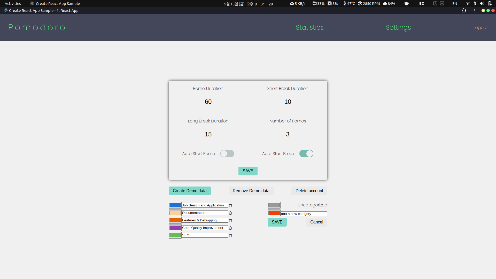

# Overview

## 소개

[pomodoro technique](https://ko.wikipedia.org/wiki/%ED%8F%AC%EB%AA%A8%EB%8F%84%EB%A1%9C_%EA%B8%B0%EB%B2%95)을 기반으로 하는 공부 & 작업 시간 측정 App입니다. 한 사이클의 작업 시간을 여러 개의 작업 세션들과 그에 뒤따르는 짧은 휴식 그리고 다음 사이클 시작 전의 마지막 긴 휴식으로 나누어 높은 집중력을 유지하는 데 도움을 줍니다.
(작업 시간을 pomodoro 또는 pomo라고 부릅니다).

`One cycle == (pomo + short break) * number of pomos + long break`

그리고 작업 시간에 대한 통계를 제공하여 사용자가 현재 상태를 파악하는데 도움을 주고 동기부여가 될 수 있도록 도와줍니다.

## 만들게 된 계기

원래 사용하던 앱이 있었는데, 일시 정지를 한 번 했을 때 얼마 동안 했는지 기록이 안 되어서, 그것을 계기로 내가 원하는 기능들을 추가하면서 배워보자는 생각으로 만들기 시작했습니다.

## 기술 스택

<!-- ### 프론트엔드

- React, React Router DOM, Axios, Firebase Authentication
- React Inline Style, Styled Components
- TypeScript, Rechart, idb, date-fns

### 백엔드

- NestJS, Express
- Firebase Admin
- MongoDB Atlas, Mongoose, @nest/mongoose -->

### 프론트엔드

#### HTML, CSS, JavaScript and WEB APIs

- CSS
  - [Positioning](https://developer.mozilla.org/en-US/docs/Learn/CSS/CSS_layout/Positioning), [Coordinate systems](https://developer.mozilla.org/en-US/docs/Web/CSS/CSSOM_view/Coordinate_systems)
    - [example](https://pomodoro-doc.vercel.app/features#%EC%8B%9C%EA%B0%81%EC%A0%81-%ED%94%BC%EB%93%9C%EB%B0%B1-19-17-16)
- WEB APIs
  - [matchMedia](https://developer.mozilla.org/en-US/docs/Web/API/Window/matchMedia), [MediaQueryList](https://developer.mozilla.org/en-US/docs/Web/API/MediaQueryList)
    - [example](https://pomodoro-doc.vercel.app/features#%EB%B0%98%EC%9D%91%ED%98%95-%EB%94%94%EC%9E%90%EC%9D%B8-29-34)

#### TypeScript

- [Index Signatures](https://www.typescriptlang.org/docs/handbook/2/objects.html#index-signatures)
- [Generic Types](https://www.typescriptlang.org/docs/handbook/2/generics.html#generic-types), [Conditional Types](https://www.typescriptlang.org/docs/handbook/2/conditional-types.html)
  - [example](https://github.com/Yonghwan-Song/pomodoro/blob/main/client/src/Custom-Hooks/useFetch.tsx#L43)

<!-- #### SPA Related

- React
  - useMemo, useCallback, useContext, and etc
- React Router DOM - Nested Routing -->

#### SPA (Single Page Application)

- React
  - `useMemo`, `useCallback`, `useContext`, etc.
- React Router DOM
  - Nested Routing

#### HTTP Requests & Authentication

- Axios
  - [axios instance](https://axios-http.com/docs/instance), [interceptors](https://axios-http.com/docs/interceptors)
    - [example](https://github.com/Yonghwan-Song/pomodoro/tree/main/client/src/axios-and-error-handling)
- [Firebase Authentication](https://firebase.google.com/docs/auth/web/start)

#### Styling

- Styled Components, React Inline Style

#### Etc

- [Recharts](https://recharts.org/)
  - [example](https://github.com/Yonghwan-Song/pomodoro/tree/main/client/src/Pages/Statistics/Graph-Related)
- [idb](https://www.npmjs.com/package/idb)
  - for a promise-based interface for interacting with Indexed DB
- date-fns
- JavaScript Design Patterns
  - Pub/Sub (Publisher-Subscriber Pattern)
    - [example](https://pomodoro-doc.vercel.app/problem-solving#%ED%95%B4%EA%B2%B0-%EB%B0%A9%EC%8B%9D-1)

### 백엔드

- NestJS, Express
- [Firebase Admin](https://www.npmjs.com/package/firebase-admin)
- MongoDB Atlas, Mongoose, @nest/mongoose

### 호스팅

- Vercel - React app
- [Render.com](https://render.com) - API server

## 기능 요약

- [포모도로와 휴식으로 구성된 한 사이클에 대한 설정 및 각 세션의 측정](https://pomodoro-doc.vercel.app/features#settings)
- [타임라인을 통해 시각적 피드백 제공](https://pomodoro-doc.vercel.app/features#timeline)
- [자동 시작](https://pomodoro-doc.vercel.app/features#autostart)
- [Statistics 페이지에서 주간 통계 제공](https://pomodoro-doc.vercel.app/features#statistics)
- [세션을 구분하기 위한 카테고리 생성](https://pomodoro-doc.vercel.app/features#settings)
- [한 세션에서 여러 카테고리의 작업 가능](https://pomodoro-doc.vercel.app/features#categorized-sessions)
- [카테고리별 통계](https://pomodoro-doc.vercel.app/features#total-graph)
- [일시 정지 및 정지한 시간 측정](https://pomodoro-doc.vercel.app/features#time-countdown-and-pause)
  - 한 세션에서 한 일시 정지들을 타임라인에 그려서 피드백 제공
- [세션 진행 도중 `/timer`, `/statistics`, 그리고 `/settings` 페이지 간 자유롭게 이동 가능](https://pomodoro-doc.vercel.app/problem-solving#%ED%95%9C-%EC%84%B8%EC%85%98%EC%9D%B4-%EC%A7%84%ED%96%89-%EC%A4%91%EC%9D%BC-%EB%95%8Cpomo-or-break-%EA%B4%80%EA%B3%84%EC%97%86%EC%9D%B4-%EB%8B%A4%EB%A5%B8-%ED%8E%98%EC%9D%B4%EC%A7%80%EB%93%A4%EC%9D%84-%EC%9E%90%EC%9C%A0%EB%A1%AD%EA%B2%8C-%EB%B0%A9%EB%AC%B8%ED%95%A0-%EC%88%98-%EC%9E%88%EB%8F%84%EB%A1%9D-%ED%95%98%EB%8A%94-%EA%B2%83)

## 아키텍처

## Page Screenshots

아래는 각 페이지의 간단한 스크린샷입니다. 구체적인 기능 설명은 'Features' 사이드바 항목에서 다루겠습니다.

### `/timer`

세션 진행 도중에 카테고리 바꾼 경우.

타임라인  

### `/statistics`

#### Total Graph and Category graph

두번째 그래프에 `Uncategorized`만 그려짐.  

두번째 그래프에 `Documentation` 와 `Development`.  

두번째 그래프에 `Uncategorized` 와 `Job Search and Application`.  

#### Two graphs show different week data

첫번째 - `11.4 ~ 11.10`, 두번째 - `10.28 ~ 11.3`.  

첫번째 - `10.28 ~ 11.3`, 두번째 - `11.4 ~ 11.10`.  

#### Mouse hover over each graph

  

#### Weekly Trend

### `/settings`

  

