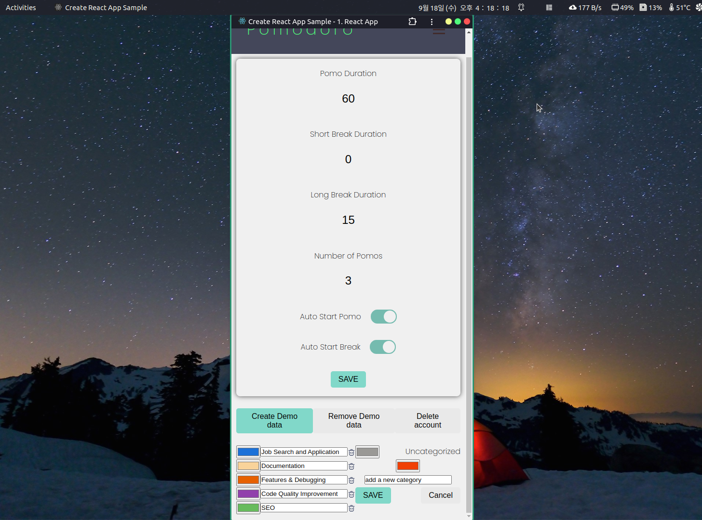

# Overview

## 개념

[pomodoro technique](https://ko.wikipedia.org/wiki/%ED%8F%AC%EB%AA%A8%EB%8F%84%EB%A1%9C_%EA%B8%B0%EB%B2%95)을 기반으로 하는 공부 & 작업 시간 측정 App입니다. 한 사이클의 작업 시간을 여러 개의 작업 세션들과 그에 뒤따르는 짧은 휴식 그리고 다음 사이클 시작 전의 마지막 긴 휴식으로 나누어 높은 집중력을 유지하는 데 도움을 줍니다.
(작업 시간을 pomodoro 또는 pomo라고 부릅니다).

`One cycle == (pomo + short break) * number of pomos + long break`

## 만들게 된 계기

원래 사용하던 앱이 있었는데, 일시 정지를 한 번 했을 때 얼마 동안 했는지 기록이 안 되어서, 그것을 계기로 내가 원하는 기능들을 추가하면서 배워보자는 생각으로 만들기 시작했습니다.

## 기술 스택

<!-- ### 프론트엔드

- React, React Router DOM, Axios, Firebase Authentication
- React Inline Style, Styled Components
- TypeScript, Rechart, idb, date-fns

### 백엔드

- NestJS, Express
- Firebase Admin
- MongoDB Atlas, Mongoose, @nest/mongoose -->

### 프론트엔드

- React, React Router DOM, Axios, Firebase Authentication
- React Inline Style, Styled Components
- TypeScript, Rechart, idb, date-fns

### 백엔드

- NestJS, Express
- Firebase Admin
- MongoDB Atlas, Mongoose, @nest/mongoose

### 호스팅

- Vercel - React app
- Render.com - API server

## 기능 요약

- [포모도로와 휴식으로 구성된 한 사이클에 대한 설정 및 각 세션의 측정](./features.mdx#settings)
- [타임라인을 통해 시각적 피드백 제공](./features.mdx#timeline)
- [자동 시작](./features.mdx#autostart)
- [Statistics 페이지에서 주간 통계 제공](./features.mdx#statistics)
- [세션을 구분하기 위한 카테고리 생성](./features.mdx#settings)
- [카테고리별 통계](./features.mdx#category-graph)
- [일시 정지 및 정지한 시간 측정](./features.mdx#time-countdown-and-pause)
  - 한 세션에서 한 일시 정지들을 타임라인에 그려서 피드백 제공
- [세션 진행 도중 `/timer`, `/statistics`, 그리고 `/settings` 페이지 간 자유롭게 이동 가능](./features.mdx#한-세션이-진행-중일-때pomo-or-break-관계없이-다른-페이지들을-자유롭게-방문할-수-있도록-하는-것)

## 아키텍처

## Page Screenshots

아래는 각 페이지의 간단한 스크린샷입니다. 구체적인 기능 설명은 'Features' 사이드바 항목에서 다루겠습니다.

### `/timer`

세션 진행 도중에 카테고리 바꾼 경우.

타임라인  

### `/statistics`

#### Total Graph and Category graph

두번째 그래프에 `Uncategorized`만 그려짐.  

두번째 그래프에 `Documentation` 와 `Development`.  

두번째 그래프에 `Uncategorized` 와 `Job Search and Application`.  

#### Two graphs show different week data

첫번째 - `11.4 ~ 11.10`, 두번째 - `10.28 ~ 11.3`.  

첫번째 - `10.28 ~ 11.3`, 두번째 - `11.4 ~ 11.10`.  

#### Mouse hover over each graph

  

### `/settings`

  

