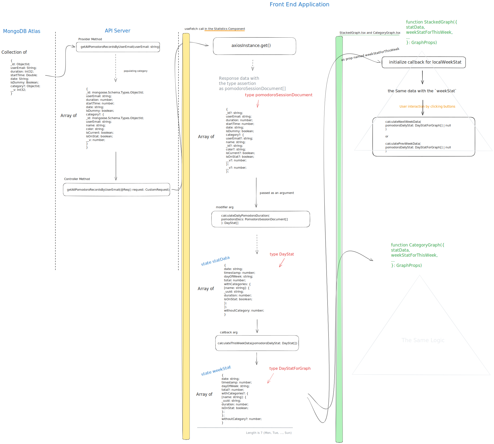
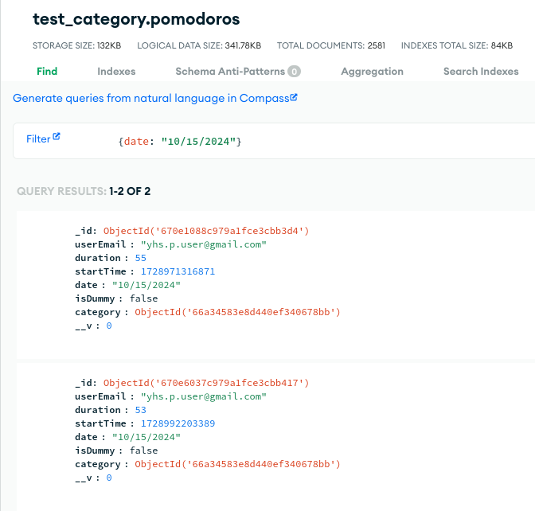
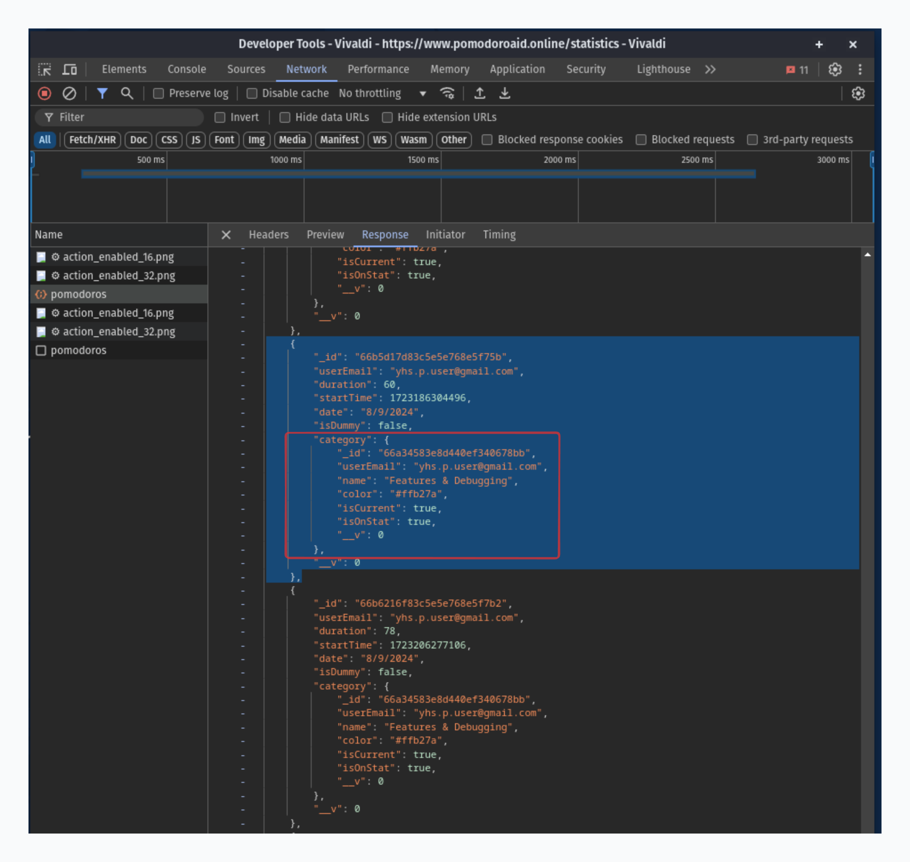
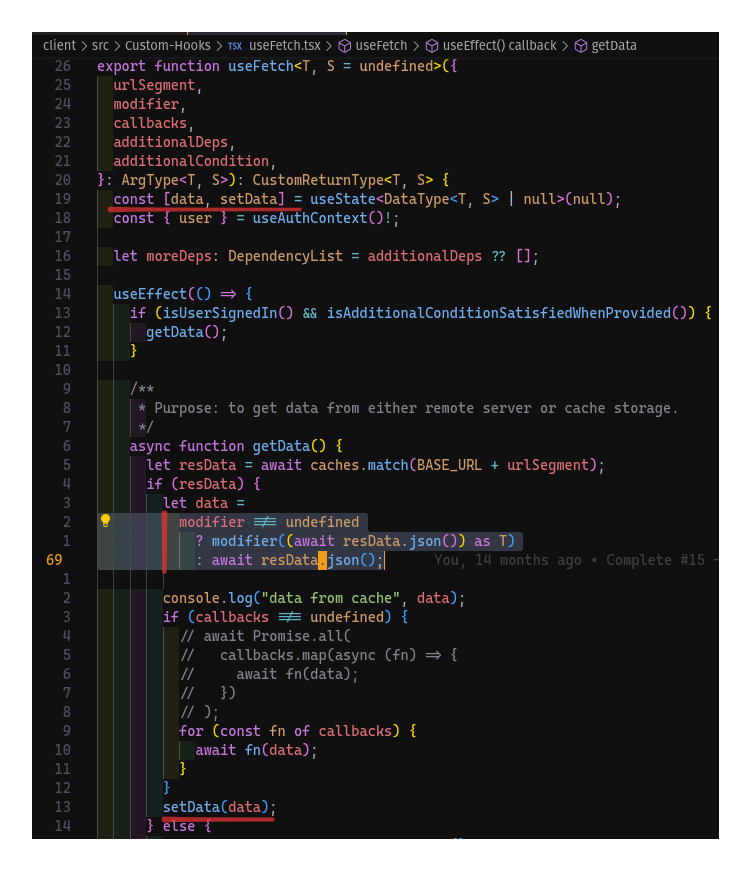
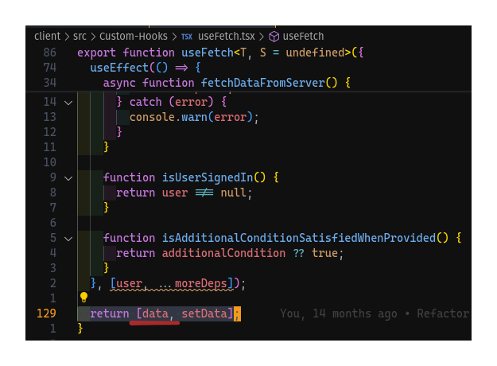
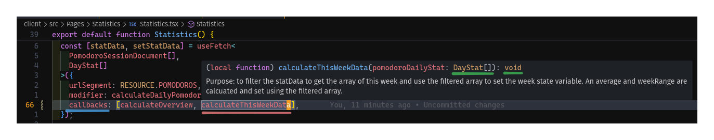
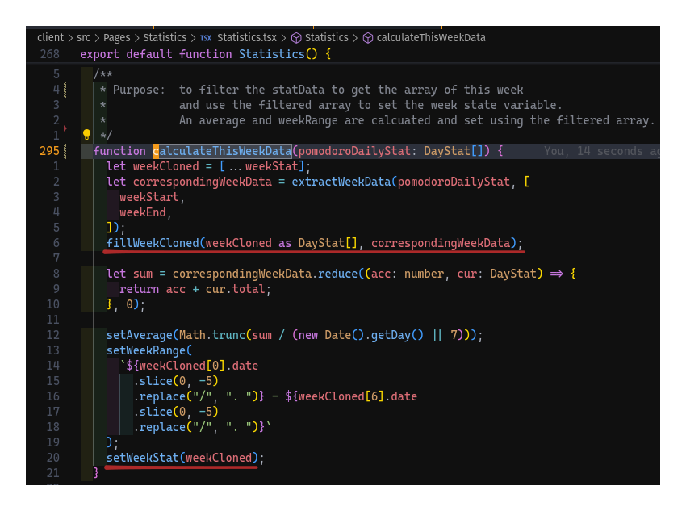
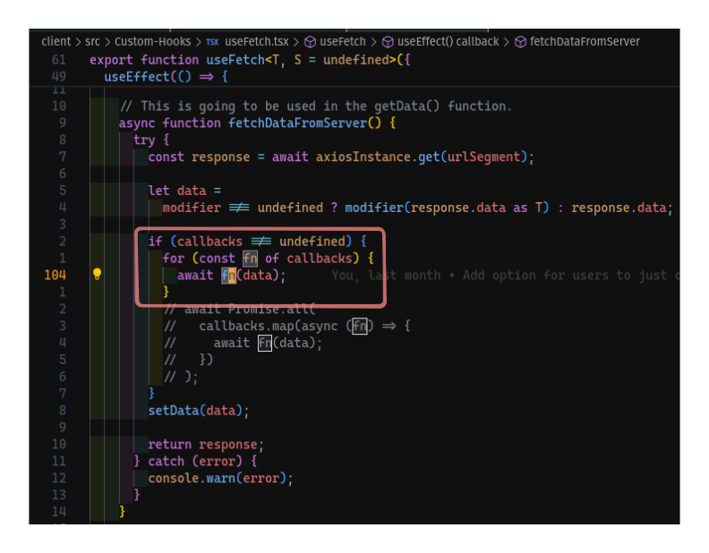
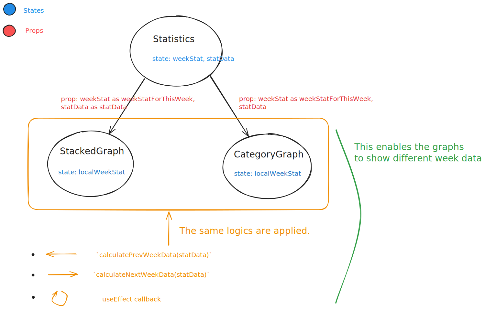

# Pomodoro session 데이터의 흐름

{/* Overview of Pomodoro Session Data Flow */}
[Open in a new tab](./img/from-server-to-client-visualization-scale-x-1.svg)


## Server에서 Client로

MongoDB에서 시작해서 `/statistics` 페이지에 이르기까지 데이터가 어떻게 가공되는지 전반적인 설명.

### MongoDB

다음과 같이 정의된 schema (nest-mongoose)에 의해 만들어지는 **document object들이
한 collection**을 이룬다.

```ts
@Schema()
export class Pomodoro {
  @Prop({ required: true })
  userEmail: string;

  @Prop({ required: true })
  duration: number;

  @Prop({ required: true })
  startTime: number;

  @Prop({ required: true })
  date: string;

  @Prop({ default: false })
  isDummy: boolean;

  @Prop({ type: mongoose.Schema.Types.ObjectId, ref: "Category" })
  category?: ObjectId;
}
```

실제 서버에 저장된 document.  


### API Server

다음과 같은 함수에 의해 MongoDB에 있는 데이터가 API Server로 옮겨지고 **population의
과정을 거친 후 Client로** 보내진다.

Controller

```ts
  @Get()
  async getAllPomodoroRecordsByUserEmail(@Req() request: CustomRequest) {
    return await this.pomodorosService.getAllPomodoroRecordsByUserEmail(
      request.userEmail,
    );
  }
```

Provider

```ts
  async getAllPomodoroRecordsByUserEmail(userEmail: string) {
    const categories = await this.categoryModel.find({ userEmail }).exec();

    const cateInfoForStat = categories.reduce<
      { name: string; color: string; isOnStat: boolean }[]
    >((previousValue, currentValue) => {
      const { name, color, isOnStat } = currentValue;
      previousValue.push({ name, color, isOnStat });
      return previousValue;
    }, []);
    const pomodoroDocs = await this.pomodoroModel
      .find({ userEmail })
      .populate('category')
      .exec();

    return pomodoroDocs;
    return { pomodoroDocs, cateInfoForStat };
  }
```

**Population**  
`populate()`에 의해 위의 `category?`의 ObjectId가 아래의 shcmea에 의해 정의되는 Category Object로 대체된 형태이다.

```ts
@Schema()
export class Category {
  @Prop({ required: true })
  userEmail: string;

  @Prop({ required: true })
  name: string;

  @Prop({ required: true })
  color: string;

  @Prop({ required: true, default: false })
  isCurrent: boolean;

  @Prop({ required: true, default: false })
  isOnStat: boolean;
}
```

아래처럼 웹브라우저 developer tools의 network tab에서 populate 된 형태를 확인할 수 있다.  


### Front End - state의 형태로 데이터 보관

#### States in the `Statistics` component

##### `statData`

1. `useFetch()`에 의해 HTTP 요청이 보내지고, 그것에 대한 Response를 `PomodoroSessionDocument[]`의 형태로 받아낸다.
2. 그리고 modifier argument가 존재하므로, 그것에 의해 `PomodoroSessionDocument[]`는 `DayStat[]`으로 변환된다.
3. `useFetch()`는 그 변환된 값을 return하고 그 값은 `Statistics` component에서의 `statData` state으로 저장된다.

---

1.

```tsx
const [statData, setStatData] = useFetch<PomodoroSessionDocument[], DayStat[]>({
  urlSegment: RESOURCE.POMODOROS,
  modifier: calculateDailyPomodoroDuration,
  callbacks: [calculateOverview, calculateThisWeekData],
});
```

```tsx
export type PomodoroSessionDocument = {
  _id?: string;
  userEmail: string;
  duration: number;
  startTime: number;
  date: string;
  isDummy: boolean;
  category?: CategoryForStat;
  __v?: number;
};
```

2. Modifier - `calculateDailyPomodoroDuration(pomodoroDocs: PomodoroSessionDocument[]):
DayStat[]`

```tsx
export type DayStat = TimeRelated & DurationRelated;
type TimeRelated = {
  date: string;
  timestamp: number;
  dayOfWeek: string;
};

type DurationRelated = {
  total: number;
  withCategories: CategoryStat;
  withoutCategory: number;
};
```

3. Modifier in the `useFetch()`
   
   

##### `weekStat`

```tsx
const [weekStat, setWeekStat] = useState<DayStatForGraph[]>(init);
```

```tsx
// The total is optional since there might be some weekdays not coming yet.
// e.g. If today is Thu, the remaining three days should not have total properties
//      so that the area chart can only show data until today.
export type DayStatForGraph = TimeRelated & Partial<DurationRelated>;
```

1. 어떤 한 `주`에 관한 통계이므로, `statData`에서 그 `주`에 해당되는 값들만 잘라내야 한다.
2. 그렇게 하기 위해, `DayStat[]`을 argument로 받는 `calculateThisWeek()`함수를 `useFetch()`의 callbacks argument로 보낸다.
3. `useFetch()`내부에서 callback함수는 `statData`가 될 `data`를 이용해서 적절한 계산을 수행한 후에, 얻어낸 한 `주`의 통계를 이용해 `setWeekStat()`을 호출한다.

---

2. <br />
   

3. <br />
   
   <br />
   

#### States in the `StackedGraph` and `CategoryGraph` components

1. 각자 week data를 저장하기 위한 state를 가지고 있지만, 다음과 같이 `Statistics` component로부터 초기값을 prop으로 받아온다.
2. 그래프 우측 상단에 있는 두개의 화살표를 클릭하면 다음 주 혹은 이전 주의 데이터를 보여주기 위해 `statData` prop을 이용해 새로운 week data값을 계산한다.
3. Parent component에서 `statData` 자체에 변화가 있을 경우, 그것을 그래프에 반영하기 위해 `useEffect`를 이용한다.

---



{/* ## Client에서 Server로 */}
