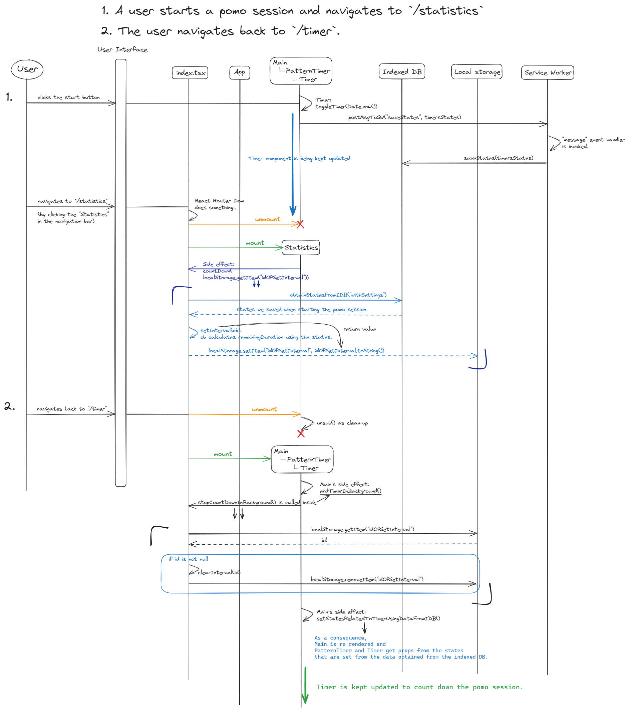

# Problem Solving

## **한 세션이 진행 중일 때(pomo or break 관계없이), 다른 페이지들을 자유롭게 방문할 수 있도록 하는 것**

### <u>A. 다른 페이지를 방문 후 세션이 종료되기 전에 `/timer`로 돌아오는 경우</u>

#### 문제 상황

우선 기본적으로 `/timer`에 render되어 있는 countdown timer UI는 [PatternTimer](https://github.com/Yonghwan-Song/pomodoro/blob/bb5c1d3b0623ff6d507d14494f7d678837d16581/client/src/Components/PatternTimer/PatternTimer.tsx#L31-L38)와 [Timer](https://github.com/Yonghwan-Song/pomodoro/blob/bb5c1d3b0623ff6d507d14494f7d678837d16581/client/src/Components/Timer/Timer.tsx#L59-L71)에 의해 만들어집니다. 다시 말하면, 이 component들의 `timersStates`[^1]에 의해 타이머 UI가 적절한 값을 표현하게 됩니다 (몇 분 남았는지, 이번 세션이 pomo인지 break인지 등). 다른 페이지로 이동한다는 것은 이 component들이 unmount되어 state값들에 대한 접근을 잠시 잃어버리는 것을 의미합니다. ==하지만 이 값들을 결국 `/timer`로 돌아올 때 사용해야 하므로 어디엔가 저장을 해야 합니다.==

#### 해결 방식

`timersStates`이 update 될 때마다(예를 들면, session의 종류가 바뀌거나 pause/resume을 할 때) **indexedDB**에 저장/update 해두었습니다. 그리고 나중에 사용자가 `/timer`로 돌아올 때 그 값을 이용해 PatternTimer와 Timer를 마운트 하였습니다.

#### 어려웠던 점

처음에는 PatternTimer와 Timer에서 useEffect를 사용해서 각 component의 state값들을 설정했는데, 이 경우 initial mount이후에 update되는 방식이어서 처음에 25분이라는 initial값이 보였다가 다시 실제로 남은 시간이 보이는 부분이 부자연스러웠습니다. 그래서 component들의 **state들의 initial값을 indexedDB에 저장되어 있는 값으로** 설정하려 했습니다. 그런데 state의 initializer함수는 async callback을 받지 않는다는 점 그리고 indexedDB의 operation은 모두 async였다는 점이 문제였습니다. 그래서 위의 두 component들의 공통 조상인 [Main component에서 useEffect를 이용해 indexedDB의 값을 받아온 후 이 값이 준비된다는 조건부로](https://github.com/Yonghwan-Song/pomodoro/blob/bb5c1d3b0623ff6d507d14494f7d678837d16581/client/src/Pages/Main/Main.tsx#L251) PatternTimer와 Timer의 또 다른 공통 component인 TogglingTimer를 render하는 방식으로 문제를 해결했습니다.

#### Sequence Diagram

[원본 링크](https://github.com/Yonghwan-Song/pomodoro/assets/72689705/435773c7-a742-4c71-b6c6-fcedcac5544e)

### <u>B. 다른 페이지에 머무르는 동안 세션이 종료되는 경우</u>

#### 문제 상황

pomodoro인지 break인지 그것의 duration은 어느 정도인지 등 타이머 UI에 표현되는 정보들은 `timerStates`에 의해 결정됩니다. 그러므로 다른 페이지 방문 중에 어떤 한 세션이 종료되면, 1)`timerStates`를 적절히 update해야 합니다. 그렇게 하면, `/timer`로 돌아왔을 때 다음 타이머 UI에 다음 세션을 곧바로 나타낼 수 있습니다. 그리고 만약 pomodoro 세션이 `/statistics`에서 종료된다면, 2)통계 그래프에 종료된 세션만큼의 시간 추가해야 합니다.

#### 해결 방식

우선 종료 시점을 계산하기 위해서는 `/timer`를 벗어난 순간부터 누군가는 계속 이어서 그 세션을 count down해야 하므로, index.tsx파일에 다음처럼 [countDown 함수](https://github.com/Yonghwan-Song/pomodoro/blob/bb5c1d3b0623ff6d507d14494f7d678837d16581/client/src/index.tsx#L647)를 정의하여 export했습니다. 이것들은 다른 페이지의 component가 mount되면 side effect으로 호출됩니다.

1. service worker script를 이용해서, indexed db에 저장된 상태들을 update합니다. 이렇게 되면 다시 `/timer`로 돌아왔을 때 update된 값을 이용해서 바로 다음 세션을 진행할 수 있는 UI를 render할 수 있습니다.
2. `/statistics`에서 pomo session이 종료될 때, 그 값을 통계 그래프에 곧바로 반영하기 위해 pusub pattern을 사용 했습니다[^2].

#### 어려웠던 점

원래는 service worker가 background작업을 할때 쓸 수 있다고 하여 선택하였는데, countDown함수 처럼 setInterval을 call해도 시간이 어느정도 지나면 자동으로 다운되었습니다. 알고보니 event위주로 사용할 수 있고, 실제로 그냥 독립적인 제가 완전히 컨트롤 할 수 있는 스크립트 파일이 아니였습니다. 그래서 코드를 수정하여 countDown을 sw.js에서 index.tsx로 옮기고 session이 끝날때 기존에 작성했던 것들을 활용하기 위해 sw.js에 message (event)를 날려서 필요한 작업들을 할 수 있게 했습니다[^3] .

#### Sequence Diagram

[원본 링크](https://github.com/Yonghwan-Song/pomodoro/assets/72689705/c146532e-f4c5-45c5-a16f-c74333aeb3f3)

 
 

[^1]: `type TimersStatesType = TimerStateType & PatternTimerStatesType` - [Github source code link](https://github.com/Yonghwan-Song/pomodoro/blob/bb5c1d3b0623ff6d507d14494f7d678837d16581/client/src/types/clientStatesType.ts#L1-L15)
[^2]: [Statistics.tsx](https://github.com/Yonghwan-Song/pomodoro/blob/bb5c1d3b0623ff6d507d14494f7d678837d16581/client/src/Pages/Statistics/Statistics.tsx#L266-L306), [pubsub.ts](https://github.com/Yonghwan-Song/pomodoro/blob/bb5c1d3b0623ff6d507d14494f7d678837d16581/client/src/pubsub.ts#L10-L43)
[^3]: [index.tsx](https://github.com/Yonghwan-Song/pomodoro/blob/bb5c1d3b0623ff6d507d14494f7d678837d16581/client/src/index.tsx#L678), [sw.js](https://github.com/Yonghwan-Song/pomodoro/blob/bb5c1d3b0623ff6d507d14494f7d678837d16581/client/src/sw.js#L82-L84)
