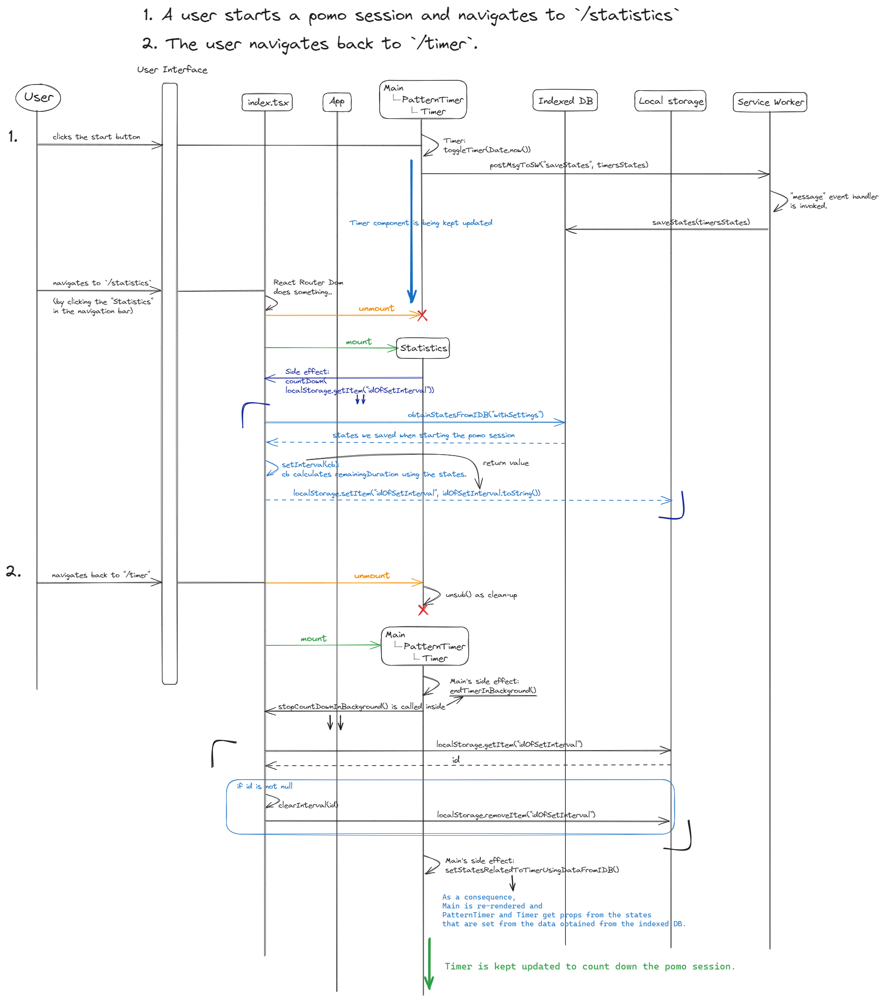
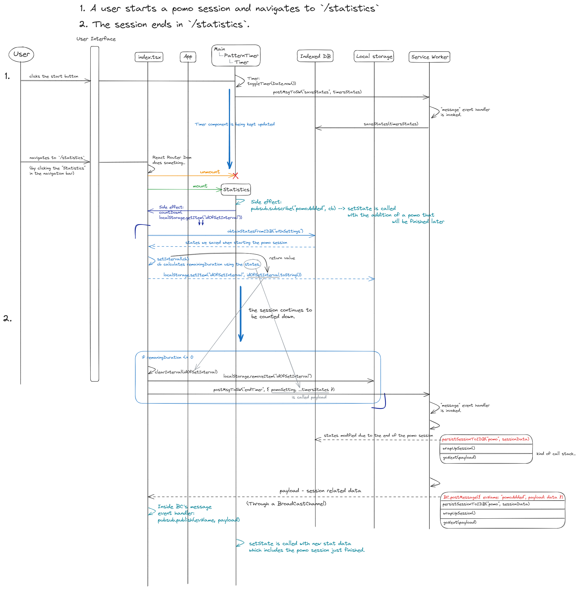

import { Highlight } from "../src/components/Highlight";

# Problem Solving

## **한 세션이 진행 중일 때(pomo or break 관계없이), 다른 페이지들을 자유롭게 방문할 수 있도록 하는 것**

### <u>A. 다른 페이지를 방문 후 세션이 종료되기 전에 `/timer`로 돌아오는 경우</u>

#### 문제 상황

우선 기본적으로 `/timer`에 렌더되는 countdown timer UI는 [PatternTimer](https://github.com/Yonghwan-Song/pomodoro/blob/bb5c1d3b0623ff6d507d14494f7d678837d16581/client/src/Components/PatternTimer/PatternTimer.tsx#L31-L38)[^1]와 [Timer](https://github.com/Yonghwan-Song/pomodoro/blob/bb5c1d3b0623ff6d507d14494f7d678837d16581/client/src/Components/Timer/Timer.tsx#L59-L71)에 의해 만들어집니다.
다시 말하면, 이 component들의 `timersStates`[^2]에 의해 타이머 UI가 적절한 값을 표현하게 됩니다 (몇 분 남았는지, 이번 세션이 pomo인지 break인지 등).
다른 페이지로 이동한다는 것은 이 component들이 unmount되어 state값들에 대한 접근을 잠시 잃어버리는 것을 의미합니다.

<span style={{ color: "#1565c0" }}>
  {" "}
  하지만 이 값들을 결국 `/timer`로 돌아올 때 사용해야 하므로 어디엔가 저장을 해야
  합니다.
</span>

#### 해결 방식

`timersStates`이 update 될 때마다(예를 들면, session의 종류가 바뀌거나 pause/resume을 할 때) **indexedDB**에 저장/update 해두었습니다. 그리고 나중에 사용자가 `/timer`로 돌아올 때 그 값을 이용해 PatternTimer와 Timer를 마운트 하였습니다.

#### 어려웠던 점

처음에는 `PatternTimer`와 `Timer`에서 `useEffect`를 사용해 각 컴포넌트의 상태값을 설정했습니다. <span style={{ color: "#1565c0" }}>하지만 이 방법은 컴포넌트가 마운트된 후에 상태가 업데이트되는 방식이라, 처음에 25분이라는 초기 상태값이 잠깐 보였다가 실제 남은 시간이 표시되는 과정이 부자연스러웠습니다.</span>
이를 해결하기 위해 각 컴포넌트의 초기 상태값을 `indexedDB`에 저장된 값으로 설정하려 했습니다. 그러나 `useState` 함수는 비동기 콜백함수를 argument로 받지 않고[^5], `indexedDB`의 작업은 모두 비동기 방식으로 처리된다는 것이 문제였습니다.
그래서 두 컴포넌트의 공통 부모인 `Main` 컴포넌트에서 indexedDB에 저장된 상태값들을 받아오는 useEffect를 다음과 같이 호출했습니다.

```tsx
export default function Main() {

...

  //
  useEffect(setStatesRelatedToTimerUsingDataFromIDB, []);

  //
  function setStatesRelatedToTimerUsingDataFromIDB() {
    const getStatesFromIDB = async () => {
      let states = await obtainStatesFromIDB("withoutSettings");
      setStatesRelatedToTimer(states);
    };
    getStatesFromIDB();
  }

...

}
```

그리고 그 값을 indexedDB에서 받아오기 전까지는 타이머 UI가 렌더되지 않도록 Main 함수에서 children을 조건부로 반환했습니다.
이렇게 하면, `PatternTimer`와 `Timer`는 prop을 이용해 실제 남은 세션 시간을 초기 상태값으로 설정할 수 있습니다.
결과적으로, 추가적인 렌더링 없이 타이머 UI를 한 번에 정확하게 렌더링할 수 있습니다.

#### Sequence Diagram

[원본 링크](https://github.com/Yonghwan-Song/pomodoro/assets/72689705/435773c7-a742-4c71-b6c6-fcedcac5544e)


### <u>B. 다른 페이지에 머무르는 동안 세션이 종료되는 경우</u>

#### 문제 상황

{/* pomodoro인지 break인지 그것의 duration은 어느 정도인지 등 타이머 UI에 표현되는 정보는 `timersStates`[^2]에 의해 결정됩니다. 그러므로 타이머 UI와 관련된 컴포넌트들이 렌더링되는 `/timer`이외 다른 페이지를 방문 중 어떤 한 세션이 종료되면, 1)`timersStates`를 **그 페이지에서** update해줘야 합니다. */}
{/* 그렇게 하면, `/timer`로 돌아왔을 때 타이머 UI에 다음 세션을 곧바로 나타낼 수 있습니다. 그리고 pomodoro 세션이 `/statistics`에서 종료되는 경우, 2)통계 그래프에 종료된 세션만큼의 시간 추가해야 합니다. */}

{/* new: */}
타이머 UI가 보여주는 정보는 세션의 종류 (pomodoro이나 break), 현재 세션이 얼마나 남았는지 등이 있는데, 이것들은 `timersStates`[^2]에 의해 결정됩니다.
다시 말하면, 한 사이클의 세션들이 매끄럽게 진행되기 위해서는 세션이 종료되었을때 `timersStates`를 update해줘야 합니다.
이것들은 타이머 UI가 렌더되는 `/timer`에서는 당연히 이뤄질 수 있지만,

1. 다른 페이지에서 세션이 종료되는 경우에도 이것을 적절히 update할 수 있어야 합니다.
2. 그리고 특히 `/statistics`에서 종료되는 경우, 통계 그래프에 종료된 pomodoro세션을 반영해야 합니다.

#### 해결 방식

우선 어떤 한 세션의 종료 시점을 계산하기 위해서는 `/timer`를 벗어난 순간부터 누군가는 계속 이어서 그 세션을 count down해야 하므로,
index.tsx파일에 다음처럼 [countDown 함수](https://github.com/Yonghwan-Song/pomodoro/blob/bb5c1d3b0623ff6d507d14494f7d678837d16581/client/src/index.tsx#L647)를 정의하여 export했습니다.
이것은 다른 페이지의 component가 mount되면 side effect으로 호출됩니다.

1. Service worker script를 이용해서, indexed db에 저장된 `timersStates`를 update합니다.
   이렇게 되면 `/timer`로 돌아왔을 때 indexedDB에서 가져오는 상태값은 세션 종료를 반영한 것이므로 이를 이용해서 바로 다음 세션 UI를 render할 수 있습니다.
2. `/statistics`에서 pomo session이 종료될 때, 그 값을 통계 그래프에 곧바로 반영하기 위해 <Highlight color="#25c2a0">**Pub/Sub 패턴**[^3]</Highlight>을 사용했습니다.

#### 어려웠던 점 - service worker가 작동하는 방식이 저의 예상과 달랐습니다.

##### Service worker를 사용한 계기

`/timer`외의 페이지는 그 페이지에서 하는 고유의 일이 있는데, 제가 해결해야 하는 것은 타이머 UI가 하는 작업이니 이것은 백그라운드에서 누군가 해줘야 한다는 생각이 있었습니다.
그래서 구글에 검색하던 도중 service worker는 리액트 앱이 돌아가는 main thread와는 다른 고유의 thread에서 돌아가기 때문에, 백그라운드 작업에 사용할 수 있다는 글을 읽었습니다.
그리고 브라우저에서 제공하는 API니까 이번 기회에 사용해봐야겠다는 생각이었습니다.

##### 예상치 못한 제약

- 세션 카운트 다운을 service worker script에서 `setInterval()`을 이용해 세션을 countdown하려 했는데, developer tools를 켜놓고 잘 돌아가는지 로그를 찍어서 확인할 때는 잘 작동했는데,
  developer tools를 끄고 실행하면 카운트 다운이 도중에 멈췄습니다. 이유는 서비스 워커 스크립트는 몇 가지 event에 반응하여 할당된 일을 마무리하면 바로 down되는 작동방식 때문이었습니다[^6].
- 그래서 코드를 수정하여 countDown을 sw.js에서 index.tsx로 옮기고 session이 끝날 때 sw.js에 message (event)를 날려서 기존에 작성했던 것들을 활용하여 필요한 작업들을 할 수 있게 했습니다[^4] .

#### Sequence Diagram

[원본 링크](https://github.com/Yonghwan-Song/pomodoro/assets/72689705/c146532e-f4c5-45c5-a16f-c74333aeb3f3)


<br />
<br />

[^1]: The component name has now been renamed to `TimerController`.
[^2]: `type TimersStatesType = TimerStateType & PatternTimerStatesType` - [Github source code link](https://github.com/Yonghwan-Song/pomodoro/blob/bb5c1d3b0623ff6d507d14494f7d678837d16581/client/src/types/clientStatesType.ts#L1-L15)
[^3]: [subscribe](https://github.com/Yonghwan-Song/pomodoro/blob/main/client/src/Pages/Statistics/Statistics.tsx#L632),[publish](https://github.com/Yonghwan-Song/pomodoro/blob/main/client/src/index.tsx#L159), [pubsub.ts](https://github.com/Yonghwan-Song/pomodoro/blob/main/client/src/pubsub.ts)
[^4]: [index.tsx](https://github.com/Yonghwan-Song/pomodoro/blob/bb5c1d3b0623ff6d507d14494f7d678837d16581/client/src/index.tsx#L678), [sw.js](https://github.com/Yonghwan-Song/pomodoro/blob/bb5c1d3b0623ff6d507d14494f7d678837d16581/client/src/sw.js#L82-L84)
[^5]: `function useState<S>(initialState: S | (() => S)): [S, Dispatch<SetStateAction<S>>]`
[^6]: https://w3c.github.io/ServiceWorker/#service-worker-lifetime
