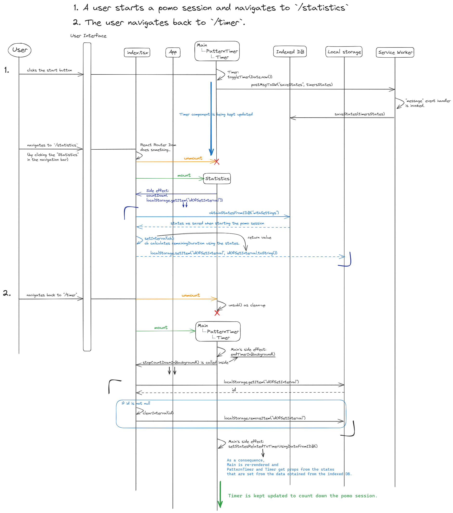
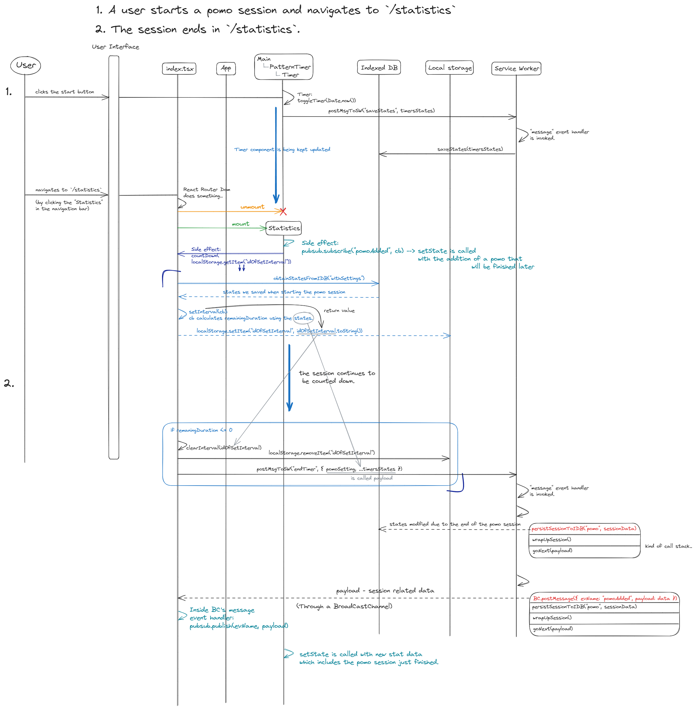
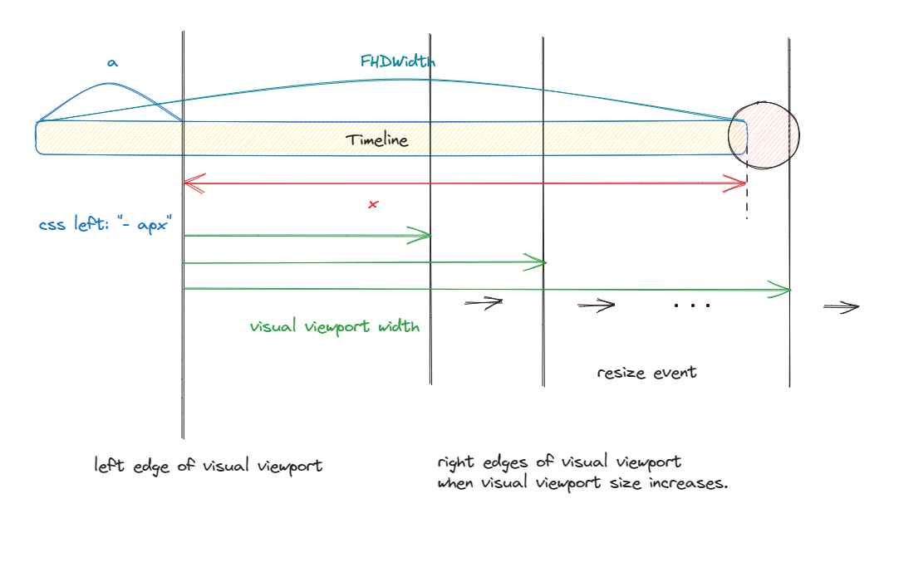

import { Highlight } from "../src/components/Highlight";
import Collapse from "../src/components/Collapse"

# Problem Solving

## **한 세션이 진행 중일 때(pomo or break 관계없이), 다른 페이지들을 자유롭게 방문할 수 있도록 하는 것**

### <u>A. 다른 페이지를 방문 후 세션이 종료되기 전에 `/timer`로 돌아오는 경우</u>

#### 문제 상황

우선 기본적으로 `/timer`에 렌더되는 countdown timer UI는 [PatternTimer](https://github.com/Yonghwan-Song/pomodoro/blob/bb5c1d3b0623ff6d507d14494f7d678837d16581/client/src/Components/PatternTimer/PatternTimer.tsx#L31-L38)[^1]와 [Timer](https://github.com/Yonghwan-Song/pomodoro/blob/bb5c1d3b0623ff6d507d14494f7d678837d16581/client/src/Components/Timer/Timer.tsx#L59-L71)에 의해 만들어집니다.
다시 말하면, 이 component들의 `timersStates`[^2]에 의해 타이머 UI가 적절한 값을 표현하게 됩니다 (몇 분 남았는지, 이번 세션이 pomo인지 break인지 등).
다른 페이지로 이동한다는 것은 이 component들이 unmount되어 state값들에 대한 접근을 잠시 잃어버리는 것을 의미합니다.

<span style={{ color: "#1565c0" }}>
  {" "}
  하지만 이 값들을 결국 `/timer`로 돌아올 때 사용해야 하므로 어디엔가 저장을 해야
  합니다.
</span>

#### 해결 방식

`timersStates`이 update 될 때마다(예를 들면, session의 종류가 바뀌거나 pause/resume을 할 때) **indexedDB**에 저장/update 해두었습니다. 그리고 나중에 사용자가 `/timer`로 돌아올 때 그 값을 이용해 PatternTimer와 Timer를 마운트 하였습니다.

#### 어려웠던 점

처음에는 `PatternTimer`와 `Timer`에서 `useEffect`를 사용해 각 컴포넌트의 상태값을 설정했습니다. <span style={{ color: "#1565c0" }}>하지만 이 방법은 컴포넌트가 마운트된 후에 상태가 업데이트되는 방식이라, 처음에 25분이라는 초기 상태값이 잠깐 보였다가 실제 남은 시간이 표시되는 과정이 부자연스러웠습니다.</span>
이를 해결하기 위해 각 컴포넌트의 초기 상태값을 `indexedDB`에 저장된 값으로 설정하려 했습니다. 그러나 `useState` 함수는 비동기 콜백함수를 argument로 받지 않고[^5], `indexedDB`의 작업은 모두 비동기 방식으로 처리된다는 것이 문제였습니다.
그래서 두 컴포넌트의 공통 부모인 `Main` 컴포넌트에서 indexedDB에 저장된 상태값들을 받아오는 useEffect를 다음과 같이 호출했습니다.

```tsx
export default function Main() {

...

  //
  useEffect(setStatesRelatedToTimerUsingDataFromIDB, []);

  //
  function setStatesRelatedToTimerUsingDataFromIDB() {
    const getStatesFromIDB = async () => {
      let states = await obtainStatesFromIDB("withoutSettings");
      setStatesRelatedToTimer(states);
    };
    getStatesFromIDB();
  }

...

}
```

그리고 그 값을 indexedDB에서 받아오기 전까지는 타이머 UI가 렌더되지 않도록 Main 함수에서 children을 조건부로 반환했습니다.
이렇게 하면, `PatternTimer`와 `Timer`는 prop을 이용해 실제 남은 세션 시간을 초기 상태값으로 설정할 수 있습니다.
결과적으로, 추가적인 렌더링 없이 타이머 UI를 한 번에 정확하게 렌더링할 수 있습니다.

#### Sequence Diagram

[원본 링크](https://github.com/Yonghwan-Song/pomodoro/assets/72689705/435773c7-a742-4c71-b6c6-fcedcac5544e)


### <u>B. 다른 페이지에 머무르는 동안 세션이 종료되는 경우</u>

#### 문제 상황

{/* pomodoro인지 break인지 그것의 duration은 어느 정도인지 등 타이머 UI에 표현되는 정보는 `timersStates`[^2]에 의해 결정됩니다. 그러므로 타이머 UI와 관련된 컴포넌트들이 렌더링되는 `/timer`이외 다른 페이지를 방문 중 어떤 한 세션이 종료되면, 1)`timersStates`를 **그 페이지에서** update해줘야 합니다. */}
{/* 그렇게 하면, `/timer`로 돌아왔을 때 타이머 UI에 다음 세션을 곧바로 나타낼 수 있습니다. 그리고 pomodoro 세션이 `/statistics`에서 종료되는 경우, 2)통계 그래프에 종료된 세션만큼의 시간 추가해야 합니다. */}

{/* new: */}
타이머 UI가 보여주는 정보는 세션의 종류 (pomodoro이나 break), 현재 세션이 얼마나 남았는지 등이 있는데, 이것들은 `timersStates`[^2]에 의해 결정됩니다.
다시 말하면, 한 사이클의 세션들이 매끄럽게 진행되기 위해서는 세션이 종료되었을때 `timersStates`를 update해줘야 합니다.
이것들은 타이머 UI가 렌더되는 `/timer`에서는 당연히 이뤄질 수 있지만,

1. 다른 페이지에서 세션이 종료되는 경우에도 이것을 적절히 update할 수 있어야 합니다.
2. 그리고 특히 `/statistics`에서 종료되는 경우, 통계 그래프에 종료된 pomodoro세션을 반영해야 합니다.

#### 해결 방식

우선 어떤 한 세션의 종료 시점을 계산하기 위해서는 `/timer`를 벗어난 순간부터 누군가는 계속 이어서 그 세션을 count down해야 하므로,
index.tsx파일에 다음처럼 [countDown 함수](https://github.com/Yonghwan-Song/pomodoro/blob/bb5c1d3b0623ff6d507d14494f7d678837d16581/client/src/index.tsx#L647)를 정의하여 export했습니다.
이것은 다른 페이지의 component가 mount되면 side effect으로 호출됩니다.

1. Service worker script를 이용해서, indexed db에 저장된 `timersStates`를 update합니다.
   이렇게 되면 `/timer`로 돌아왔을 때 indexedDB에서 가져오는 상태값은 세션 종료를 반영한 것이므로 이를 이용해서 바로 다음 세션 UI를 render할 수 있습니다.
2. `/statistics`에서 pomo session이 종료될 때, 그 값을 통계 그래프에 곧바로 반영하기 위해 <Highlight color="#25c2a0">**Pub/Sub 패턴**</Highlight>을 사용했습니다.

#### 어려웠던 점 - service worker가 작동하는 방식이 저의 예상과 달랐습니다.

##### Service worker를 사용한 계기

`/timer`외의 페이지는 그 페이지에서 하는 고유의 일이 있는데, 제가 해결해야 하는 것은 타이머 UI가 하는 작업이니 이것은 백그라운드에서 누군가 해줘야 한다는 생각이 있었습니다.
그래서 구글에 검색하던 도중 service worker는 리액트 앱이 돌아가는 main thread와는 다른 고유의 thread에서 돌아가기 때문에, 백그라운드 작업에 사용할 수 있다는 글을 읽었습니다.
그리고 브라우저에서 제공하는 API니까 이번 기회에 사용해봐야겠다는 생각이었습니다.

##### 예상치 못한 제약

- 세션 카운트 다운을 service worker script에서 `setInterval()`을 이용해 세션을 countdown하려 했는데, developer tools를 켜놓고 잘 돌아가는지 로그를 찍어서 확인할 때는 잘 작동했는데,
  developer tools를 끄고 실행하면 카운트 다운이 도중에 멈췄습니다. 이유는 서비스 워커 스크립트는 몇 가지 event에 반응하여 할당된 일을 마무리하면 바로 down되는 작동방식 때문이었습니다[^6].
- 그래서 코드를 수정하여 countDown을 sw.js에서 index.tsx로 옮기고 session이 끝날 때 sw.js에 message (event)를 날려서 기존에 작성했던 것들을 활용하여 필요한 작업들을 할 수 있게 했습니다[^4] .

<Collapse title={"pubsub definition"}>
```tsx
// reference: https://www.youtube.com/watch?v=aynSM8llOBs

type Callback = (data: any) => void;
interface PubsubType {
  events: { [index: string]: Set<(data: any) => void> };
  subscribe: (evName: string, cb: Callback) => () => void;
  unsubscribe: (evName: string, cb: Callback) => void;
  publish: (evName: string, data: any) => void;
}
export const pubsub: PubsubType = {
  events: {},

  subscribe: function (evName, cb) {
    if (!(evName in this.events)) {
      this.events[evName] = new Set();
    }
    this.events[evName].add(cb);

    return () => {
      this.events[evName].delete(cb);
    };
  },

  unsubscribe: function (evName, cb) {
    if (evName in this.events) {
      this.events[evName].delete(cb);
    }
  },

  publish: function (evName, data: any) {
    if (this.events[evName]) {
      this.events[evName].forEach((f) => {
        f(data);
      });
    }
  },
};

```
</Collapse>
<Collapse title={"publish()"}>
```tsx
// in client/src/sw.js
async function recordPomo(startTime, idTokenAndEmail, infoArray, sessionData) {
  let body = null;

  try {
    const { idToken, email } = idTokenAndEmail;
    const today = new Date(startTime);
    let LocaleDateString = `${
      today.getMonth() + 1
    }/${today.getDate()}/${today.getFullYear()}`;

    const final = convertMilliSecToMin(
      createDataSortedByTimestamp(
        infoArray,
        sessionData.pause.record,
        sessionData.endTime
      )
        .reduce(calculateDurationForEveryCategory, {
          durationArr: [],
          currentType: "focus",
          currentOwner: "",
          currentStartTime: 0,
        })
        .durationArr.reduce(aggregateFocusDurationOfTheSameCategory, {
          c_duration_array: [],
          currentCategoryName: "",
        }).c_duration_array
    ).map((val) => {
      if (val.categoryName !== "uncategorized") {
        return {
          userEmail: email,
          duration: val.duration,
          startTime: val.startTime,
          date: LocaleDateString,
          isDummy: false,
          category: {
            name: val.categoryName,
          },
        };
      } else {
        return {
          userEmail: email,
          duration: val.duration,
          startTime: val.startTime,
          date: LocaleDateString,
          isDummy: false,
        };
      }
    });

    BC.postMessage({
      evName: "pomoAdded", // <--------------------------------------------------------
      payload: final,
    });

    //...
  } catch (error) {
    console.warn(error);
  }
}

// in client/src/index.tsx
BC.addEventListener("message", async (ev) => {
  const { evName, payload } = ev.data;

  switch (evName) {
    case "pomoAdded":
      // type of the payload
      // {
      //   userEmail: string;
      //   duration: number;
      //   startTime: number;
      //   date: string;
      //   isDummy: boolean;
      //   category?: {
      //     name: string;
      //   };
      // }[]
      pubsub.publish(evName, payload); // <--------------------------------------------
      break;

    // ...

    default:
      console.warn(`Unhandled event name: ${evName}`);
      break;
  }
});

```
</ Collapse>

<Collapse title={"subscribe()"}>
```tsx
  // in client/src/Pages/Statistics/Statistics.tsx
  useEffect(() => {
    countDown(localStorage.getItem("idOfSetInterval"));

    const unsub = pubsub.subscribe(
      "pomoAdded",
      (
        final: {
          useEmail: string;
          duration: number;
          startTime: number;
          date: string;
          isDummy: boolean;
          category?: {
            name: string;
          };
        }[]
      ) => {
        setStatData((prev) => {
          if (!prev) {
            return prev;
          } else {
            let today = new Date();
            const todayDateString = `${
              today.getMonth() + 1
            }/${today.getDate()}/${today.getFullYear()}`;
            let days = ["Sun", "Mon", "Tue", "Wed", "Thu", "Fri", "Sat"];

            let cloned = [...prev];
            let doesTodayStatExist =
              cloned.length !== 0 &&
              cloned[cloned.length - 1].date === todayDateString;

            if (doesTodayStatExist) {
              for (const pomoDoc of final) {
                cloned[cloned.length - 1].total += pomoDoc.duration;
                if (pomoDoc.category) {
                  cloned[cloned.length - 1].subtotalByCategory[
                    pomoDoc.category.name
                  ].duration += pomoDoc.duration;
                } else {
                  cloned[cloned.length - 1].withoutCategory += pomoDoc.duration;
                }
              }
            }
            if (!doesTodayStatExist) {
              const now = new Date();
              const startOfTodayTimestamp = new Date(
                now.getFullYear(),
                now.getMonth(),
                now.getDate()
              ).getTime();

              let dayStat: DayStat = {
                date: todayDateString,
                timestamp: startOfTodayTimestamp,
                dayOfWeek: days[today.getDay()],
                total: 0,
                subtotalByCategory: createBaseCategorySubtotal(),
                withoutCategory: 0,
                weekNumber: getISOWeek(Date.now()),
              };

              for (const pomoDoc of final) {
                dayStat.total += pomoDoc.duration;
                if (pomoDoc.category) {
                  dayStat.subtotalByCategory[pomoDoc.category.name].duration +=
                    pomoDoc.duration;
                } else {
                  dayStat.withoutCategory += pomoDoc.duration;
                }
              }

              cloned.push(dayStat);
            }

            setSum((prev) => {
              const retVal = { ...prev };
              for (const pomoDoc of final) {
                retVal.today += pomoDoc.duration;
                retVal.thisWeek += pomoDoc.duration;
                retVal.thisMonth += pomoDoc.duration;
                retVal.allTime += pomoDoc.duration;
              }
              return retVal;
            });

            return cloned;
          }
        });
      }
    );

    return () => {
      unsub();
    };
  }, []);
```
</Collapse>

#### Sequence Diagram

[원본 링크](https://github.com/Yonghwan-Song/pomodoro/assets/72689705/c146532e-f4c5-45c5-a16f-c74333aeb3f3)



<!-- ### [비판적 질문들](./questions.mdx#한-세션이-진행-중일-때pomo-or-break-관계없이-다른-페이지들을-자유롭게-방문할-수-있도록-하는-것) -->

## **[인터넷 연결이 끊길 때에도 핵심 기능 사용할 수 있게 하기](https://pomodoro-doc.vercel.app/features#network-disconnection-handling)**

### 문제 상황 및 구현하게 된 계기 - 인터넷이 끊긴 동안 사용한 결과는 서버에 저장되지 않는다
평소에 대학교 도서관에서 작업하는데, 시험기간에 사람이 많이 몰리는 시간에는 인터넷이 간헐적으로 끊겼습니다. 이때 앱을 계속 사용하더라도 서버에 데이터가 보내지지 않기 때문에 나중에 인터넷이 연결된 후 다시 사용할 때 문제가 있었습니다. 예를 들면, 인터넷이 끊긴 상태에서 타이머가 종료되면 그 집중한 시간은 기록되지 않았습니다. 또는 어떤 집중 시간 진행 도중에 인터넷이 끊기고 카테고리를 변경하는 경우 이것은 반영되지 않습니다. 이런 식으로 인터넷이 몇 번씩 끊겼다가 연결되었다가 하면 앱에 대한 사용자 경험 안정성이 근본적으로 저하되었습니다.

### 해결 방식 - request를 보관 후 다시 보내기

- `errController` object를 정의해 이곳에 request를 보관 후 인터넷이 다시 연결되면 서버에 보냈습니다.

- 사용자가 로그아웃하거나 브라우저 탭을 닫은 후 나중에 인터넷이 연결되는 경우

  - `errController`에 있는 request를 indexed db에 저장

  - 앱을 열거나 로그인하면, 그 사용자의 request들을 가져와서 다시 서버로 보냅니다.

#### 데이터 합치기

- patch request는 resource를 변경하는 것이므로 하나로 통합할 수 있습니다.

  - 예를 들면, `/categories` 에대한 patch request는 `Categories` collection에 있는 한 카테고리 object를 수정하는 것이고,
  - 다시 말하면 그것의 property를 수정하는 것입니다.
  - *같은 object를 수정하는 request들은 하나로 통합해서 한번 보냅니다.*

  - 여러 개의 category object를 수정하게 되는 경우를 위해 batch URL을 정의

#### 어려웠던 점

category object를 식별하는 방식이 name과 userEmail의 조합의 유일성을 이용하는 것인데,

이름을 바꾸는 patch request때문에 이것을 이용할 수 없었습니다.

그래서 F.E 한정으로 사용하는 _uuid를 batch request의 경우에 한해서 식별자로 사용했습니다.

- 흐름
  - interceptor에서 `/categories`로 보내지는 patch는 interceptor에서 바로 `errController`에 등록하지 않고 error를 throw
  - axios patch를 호출한 함수에서 그 error를 catch한 후
  - _uuid를 넣어서 `errController`에 등록.

#### Service Worker에서 request 보내기

- axios대신 fetch API를 이용하므로 fetch 호출을 try catch block에 넣어서 error를 잡아냅니다.

- Error가 TypError이면 `BroadcastChannel` API를 이용해서 main thread에 데이터를 보냅니다.
- event handler가 그 데이터를 받아서 `errController`에 저장합니다.

<!-- ### [비판적 질문들](./questions.mdx#인터넷-연결이-끊길-때에도-핵심-기능-사용할-수-있게-하기) -->

## **Horizontal Timeline 만들기**

### 문제 상황 및 구현하게 된 계기

집중과 휴식 세션들을 어떻게 진행했는지 직관적인 feedback이 필요했고, 이를 위해 timeline을 만들기로 했습니다. 제 앱의 use case에 맞는 적절한 horizontal timeline UI를 제공하는 라이브러리를 찾기 어려웠고 이 기회에 CSS를 연습해보자는 생각으로 직접 구현하게 되었습니다.

### Design and Implementation

- 1분을 나타내는 px을 정해서 Timeline component의 width를 24시간만큼의 크기로 설정
- 오른쪽으로 갈수록 시간이 흘러간다고 가정하고 Timeline의 가장 왼쪽 끝을 하루의 시작인 12:00 am으로 정함
- 완료된 세션은 타임라인 가장 왼쪽 끝으로부터 얼마나 떨어트려 놓을지 계산하여 적절한 위치를 잡음
  - absolute position과 left CSS property를 이용
- 타임라인을 좌우로 움직이기 위해 마우스 스크롤과 드래그에 대해 Timeline component의 left 값을 변화시킴
  - session들은 모두 Timeline에 대해 absolutely positioned 되었기 때문에 그 위에서 함께 움직임

#### 어려웠던 점들

##### [윈도우 사이즈 변화에 responsive하게 반응](https://github.com/Yonghwan-Song/pomodoro/issues/19)

- 아래 그림처럼, visual viewport의 넓이가 x보다 커지면, 빨간색 부분처럼 빈 부분이 생김
- window resize event handler에서 visual viewport width가 x보다 커지면 timeline의 right CSS property를 0으로 설정했습니다.


Before
<br/>

<br />
After
<br />


##### [Responsive관련 css가 작동하지 않아서 Web API를 이용](https://github.com/Yonghwan-Song/pomodoro/issues/29#issue-1994595288)

- 사용하게 된 계기
  - media query를 사용하기 위해 inline style을 이용한 Timeline component를 styled component로 바꿨습니다.
  - 그런데 기존의 drag와 wheel event handler들이 ref를 이용해 Timeline element의 style object에 직접 접근하는데, 관련 코드들이 Styled Component로 바꿨을 때 잘 작동하지 않았습니다.
  - 디버깅하기에는 너무 복잡해 보여서 기존의 inline 스타일을 유지하면서 CSS media query 없이 responsive design을 적용할 방법을 찾아봤습니다.

- 전반적인 원리
  - window object의 matchMedia() method는 mediaQuery을 argument로 받고, MediaQueryList object를 반환합니다.
  - 이때, window는 현재 앱이 놓여있는 tab에 관한 것이므로, MediaQueryList이 갖게 되는 정보는 **이 tab이 mediaQuery을 만족하는지 등에 관한 것입니다.**
  - 그 정보와 MediaQueryList object가 제공하는 몇 가지 기능들을 이용하면, 앱을 여러 media에 대해 responsive하게 만들 수 있습니다.

- 바꿔야 하는 것: 몇 pixel을 가지고 24시간을 나타낼 지.
  - 예를 들면, 작은 device일수록, 작은 pixel을 이용해 24시간을 나타냅니다.
  - 이것이 결정되면 비례식으로 1초, 1분, 1시간이 몇 pixel에 해당하는지 계산하여, Scale component를 적절히 render할 수 있습니다.

```tsx
const msToPx = useRef<number>(PIXEL.PER_SEC.IN_FHD / 1000);
const fullWidthOfTimeline = useRef<number>(PIXEL.PER_HR.IN_FHD * 24);
```
```ts
export const PIXEL = {
  PER_SEC: {
    IN_MOBILE: 16 / 300,
    IN_TABLET: 16 / 225,
    IN_FHD: 8 / 60,
    IN_QHD: 16 / 90,
    IN_UHD: 4 / 15,
  },
  PER_MIN: {
    IN_MOBILE: 16 / 5,
    IN_TABLET: 64 / 15,
    IN_FHD: 8,
    IN_QHD: 32 / 3,
    IN_UHD: 16,
  },
  PER_HR: {
    IN_MOBILE: 192, // 576 <-> 3h
    IN_TABLET: 256, // 768 <-> 3h
    IN_FHD: 480, // 1920 <-> 4h
    IN_QHD: 640, // 2560 <-> 4h
    IN_UHD: 960, // 3840 <-> 4h
  },
};
```

- 처음 마운트 및 update되어 re-render되는 경우
  - 예를 들면, mobile, tablet, fhd를 target으로 하는 range에 대한 MediaQueryList를 각각 만들면,
  - 각 object의 matches property는 현재 tab이 자신들을 만족하고 있는지를 boolean 값으로 나타냅니다.
  - 따라서 component가 render되면 이 property들을 확인해서 어떤 pixel값을 적용해야 할지 결정합니다.

```tsx
if (mobileRange.matches) {
  msToPx.current = PIXEL.PER_SEC.IN_MOBILE / 1000;
  fullWidthOfTimeline.current = PIXEL.PER_HR.IN_MOBILE * 24;
} else if (tabletRange.matches) {
  msToPx.current = PIXEL.PER_SEC.IN_TABLET / 1000;
  fullWidthOfTimeline.current = PIXEL.PER_HR.IN_TABLET * 24;
} else if (fhdRange.matches) {
  msToPx.current = PIXEL.PER_SEC.IN_FHD / 1000;
  fullWidthOfTimeline.current = PIXEL.PER_HR.IN_FHD * 24;
} else if (qhdRange.matches) {
  msToPx.current = PIXEL.PER_SEC.IN_QHD / 1000;
  fullWidthOfTimeline.current = PIXEL.PER_HR.IN_QHD * 24;
} else if (uhdRange.matches) {
  msToPx.current = PIXEL.PER_SEC.IN_UHD / 1000;
  fullWidthOfTimeline.current = PIXEL.PER_HR.IN_UHD * 24;
}
```

- 마운트 후 윈도우 사이즈가 변화하는 경우
  - 예를 들면 mobile range를 나타내는 mediaQuery을 이용해서 만든 MediaQueryList가 있다고 할 때,
  - 양쪽 중 어느 쪽으로든 그 범위를 벗어나면, change event가 발생하고 이는 MediaQueryList에 전달됩니다.
  - 그러므로 event handler를 component내에서 정의하여 어느 range로 변화하는지를 포착해 적절한 msToPx값을 설정할 수 있도록 합니다.

```tsx
const handleTabletRangeAtDetailedArea = useCallback(
  (ev: MediaQueryListEvent) => {
    if (ev.matches) {
      console.log("TABLET IN DETAIL_AREA");
      divRef.current &&
        (divRef.current.style.width = PIXEL.PER_HR.IN_TABLET * 24 + "px");
      msToPx.current = PIXEL.PER_SEC.IN_TABLET / 1000;
    }
  },
  []
);

mobileRange.addEventListener("change", handleMobileRangeAtDetailedArea);
tabletRange.addEventListener("change", handleTabletRangeAtDetailedArea);
fhdRange.addEventListener("change", handleFHD_RangeAtDetailedArea);
qhdRange.addEventListener("change", handleQHD_RangeAtDetailedArea);
uhdRange.addEventListener("change", handleUHD_RangeAtDetailedArea);
```


<br />
Before
<br/>

<br />
After
<br />


<!-- ### [비판적 질문들](./questions.mdx#horizontal-timeline-만들기) -->

## **WebRTC Disconnection Handling**

### 문제 상황

- Signaling server는 TCP 위에, Media stream은 UDP(mediasoup SFU server)를 통해 전달됩니다.
- 따라서 두 프로토콜이 개별적으로 단절되는 케이스는 물론, 두 레이어가 동시에 단절되는 구간도 존재합니다.
- 이러한 모든 예외 상황을 고려하여 예외 처리를 안정적으로 구현하는 것이 가장 까다로운 과제였습니다.

### TCP 단절

방 입장 후 미디어(화면 및 음성)를 송수신하는 핵심 객체는 `Peer` 엔티티 클래스로 정의됩니다.

최초 연결 시 `Peer` 객체는 사용자의 `socket.id`를 참조하여 클라이언트 세션을 식별하고 이에 대한 소유권을 갖습니다. 하지만 네트워크가 일시적으로 단절된 후 재연결이 발생하면 Socket.IO가 새로운 `socket.id`를 부여합니다. 이 때문에 새롭게 부여된 `socket.id`만으로는 이전 사용자를 식별할 수 없어, 기존 `Peer` 객체의 세션을 복구(재소유)하는 데 어려움이 있었습니다.

이를 해결하기 위해, 변하지 않는 고유 식별자인 Firebase UID를 `Peer` 엔티티의 고유 식별 키로 도입했습니다. 재연결 요청 시 전달받은 Firebase UID를 이용해 기존 `Peer` 객체의 존재 여부를 먼저 조회하고, 일치하는 객체가 존재하면 재연결 세션으로 간주하여 새로 발급된 `socket.id`를 바인딩하는 방식으로 사용자의 연결 상태를 자연스럽게 유지하도록 구현했습니다.

<Collapse title={"socket connection and peer entity"}>
```ts
const newSocket = io(BASE_URL, {
  auth: async (cb) => {
    const currentUser = auth.currentUser;
    const token = currentUser ? await currentUser.getIdToken() : '';
    cb({ token });
  },
  reconnection: true,
  reconnectionDelay: 1000,
  reconnectionDelayMax: 5000,
  randomizationFactor: 0.5,
});
```
```ts
// signaling.gateway.ts
function handleConnection(clientSocket: Socket, ...args: any[]) {
    const uid = clientSocket.data.uid as string;
    const existingPeer = this.groupStudyManagementService.getPeer(uid);

    if (existingPeer) {
      if (existingPeer.removalTimer !== null) {
        console.log(
          `about to clear existingPeer scheduled removal of ${existingPeer.id}`,
        );
        clearTimeout(existingPeer.removalTimer);
      }

      this.groupStudyManagementService.updatePeerCurrentSocket(
        uid,
        clientSocket.id,
      );

      this.logConnectedSockets('reconnect');
    }

  //...
}
```
```ts
export class Peer {
  public readonly id: string; // Firebase uid — never changes across reconnects
  public currentSocketId: string; // current socket.id — swapped on reconnect
  public userEmail: string | null; // 받아만 두고 딱히 프론트에 보내지는 말기. 개인정보.
  public userNickname: string | null;
  public picture: string | null;
  public room: Room | null;
  public rtpCapabilities?: RtpCapabilities; // mediasoup-client의 device initialization의 결과. This means that the peer's device in the client has this `rtpCapabilities`, which we call normally just device RtpCapabilities.
  public sendTransport?: WebRtcTransport;
  public recvTransport?: WebRtcTransport;
  public readonly producerMap: Map<string, Producer> = new Map();
  public readonly consumerMap: Map<string, Consumer> = new Map(); // consumerId, Consumer

  // [Added for Real-time Duration Sync]
  // Peer가 현재까지 집중한 오늘 총 시간(분)을 서버 메모리 상에 보관합니다.
  // 방에 새로 들어오는 사람에게 이 값을 전달해주기 위해 필요합니다.
  public todayTotalDuration: number = 0; // 본인의 데이터는 더하거나 뭐 다른 method를 사용하는게 아니라 public이니까 그냥 직접 assignment하는 방식으로 update한다.
  public chatMessages: ChatMessageInfo[] = []; // sender here is peer himself // TODO: leave room -> chatMessages도 지워야함.
  // public readonly chatMessages: Array<{ message: string; peerId: string; timestamp: number }>

  public removalTimer: NodeJS.Timeout | null;

  constructor(params: {
    uid: string;
    socketId: string;
    userEmail: string | null;
    userNickname: string | null;
    picture: string | null;
  }) {
    const { uid, socketId, userEmail, userNickname, picture } = params;

    this.id = uid;
    this.currentSocketId = socketId;
    this.userEmail = userEmail;
    this.userNickname = getNickname({
      userNicknameFromGoogleAccount: userNickname,
      uid,
    });
    this.picture = picture;
    this.room = null;
  }

  //...
}
```
</Collapse>

### UDP 단절 및 동시 단절 구간이 존재하는 경우

#### UDP만 단절

- TCP 연결은 유지되나 UDP만 유실(drop)되는 경우, `mediasoup-client` transport의 `connectionstatechange` 이벤트를 감지하여 ICE Restart를 시도합니다.
- `connectionstatechange`가 `disconnected`에서 `failed` 상태로 전환되면 ICE Restart를 수행하고, 새로운 ICE parameters가 설정되면 UDP 연결을 자동으로 재시도하도록 구현했습니다.

##### ICE Restart의 원리

ICE agent가 `failed` 상태에 도달하면 RFC 8445 규격에 따라 connectivity check를 완전히 중단합니다. 이 상태에서는 네트워크가 물리적으로 복구되더라도 자동으로 재연결되지 않습니다.

따라서 ICE Restart를 통해 새로운 ICE credential(`ufrag`/`pwd`)을 발급함으로써 ICE agent가 이를 '새로운 세션'으로 인식하도록 유도하고, connectivity check를 처음부터 다시 수행하도록 만듭니다.

<Collapse title={"connectionstatechange handler"} >
```typescript
transport.on('connectionstatechange', (state) => {
  if (state === 'failed') {
    get().attemptToRestartIceWithGuards(transport, 'send', socket); // IMPT: 내부에서 socket과 transport를 이용해서 guard한다.
  }
});
```
</Collapse>

#### 두 레이어가 동시에 단절되는 경우

Socket이 연결되어 있을 때만 signaling server를 통해 ICE 협상에 필요한 parameters를 교환할 수 있습니다. 따라서 Socket.IO Manager의 `reconnect` 이벤트 핸들러 내부에서 `attemptToRestartIceWithGuards()`를 호출하도록 설계했습니다.

두 레이어가 모두 단절된 상태에서 네트워크가 복구되는 시나리오는 다음과 같이 구분할 수 있습니다.

1. **UDP down → TCP down → UDP up → TCP up**
2. **UDP down → TCP down → TCP up → UDP up**
3. **TCP down → UDP down → UDP up → TCP up**
4. **TCP down → UDP down → TCP up → UDP up**

어떤 순서로 복구되더라도 Socket이 다시 연결되는 시점에 ICE Restart를 수행하여 미디어 연결까지 함께 복구하도록 구현했습니다.

<Collapse title={"reconnect handler"} >
```ts
newSocket.io.on("reconnect", () => {
  const {
    leaveRoom,
    attemptToRestartIceWithGuards,
    sendTransport,
    recvTransport,
    isUserInRoom: isUserInRoomInClient,
    socketResetTimer,
  } = get();


  // DECISION: ClearTimeout AS SOON AS a "reconnect" event occurs
  if (socketResetTimer !== null) {
    clearTimeout(socketResetTimer);
    set({ socketResetTimer: null }, false, "socket/initialize-reset-timer");
  }

  newSocket.volatile.emit(
    EventNames.CHECK_PEER_STATUS_IN_SERVER,
    (res: AckResponse<PeerStatus>) => {
      if (res.success && res.data) {
        const {
          doesPeerExistInPeerMap: doesPeerExistInPeerMapInServer,
          isPeerInRoom: isPeerInRoomInServer,
        } = res.data;
        // DESIGN: 위에 주석에 해당되는 부분
        // IMPT: 3가지 분기점 A, B, C -> [1]이것들 모두 서버로부터의 peerStatus를 가지고 판단한다. [2]그리고, 그 분기점들 내부에서 room check를 한번 해준다([FE]정보 크로스체크)
        // 3 * 2 = 총 6개의 가능성 => 서버쪽을 기준으로 맞춰야함. 왜냐하면, 단절된 당사자의 UX보다 단절되지 않고 참가하고 있는 participants의 UX가 더 중요함.
        if (doesPeerExistInPeerMapInServer) {
          // 항상 true 애초에 peerMap에 등록되고나서 이 message가 전달될 수 밖에 없다.
          if (isPeerInRoomInServer) {
            // NOTE: A
            if (isUserInRoomInClient) {
              // NOTE: [2]
              console.log("[SS, FE] -> [Room, Room]");
              setTimeout(() => {
                console.log(
                  "invoking attemptToRestartIce with send in CHECK_PEER_STATUS_IN_SERVER ack cb",
                );
                sendTransport !== null &&
                  attemptToRestartIceWithGuards( // <--------------------------------------------------------
                    sendTransport,
                    "send",
                    newSocket,
                  );
              }, 0);

              setTimeout(() => {
                console.log(
                  "invoking attemptToRestartIce with recv in CHECK_PEER_STATUS_IN_SERVER ack cb",
                );
                recvTransport !== null &&
                  attemptToRestartIceWithGuards( // <--------------------------------------------------------
                    recvTransport,
                    "recv",
                    newSocket,
                  );
              }, 1000);
            } else {
              console.log("[SS, FE] -> [Room, Lobby]");
            }
          } else {
            // 애초에 연결 끊겼을 당시에 lobby에서 끊긴 경우
            // NOTE: B
            if (isUserInRoomInClient) {
              // NOTE: [2]
              console.log("[SS, FE] -> [Lobby, Room]");
              leaveRoom(false);
              set({
                forcedRoomExitReason: "tcp-socket-prolonged-disconnect",
              });
            } else {
              console.log("[SS, FE] -> [Lobby, Lobby]");
            }
          }
        }
      } else {
        console.warn("dead path is reached. Something went wrong.");
      }
    },
  );
});
```

</ Collapse>

##### Edge Cases

- **ICE Restart 요청에 대한 ACK response를 받기 전에 TCP가 다시 단절되는 경우**
  - TCP Socket이 복구되는 시점에 ICE Restart를 다시 시도합니다.
- **ICE Restart 요청을 전송한 직후, ACK response가 도착하기 전에 TCP가 단절되는 경우**
  - TCP가 곧바로 복구되면 ICE Restart 요청을 한 번 더 전송합니다.
  - 이 경우, 먼저 보낸 요청과 나중에 보낸 요청의 ACK response가 모두 도달하는 중복 수신 문제가 발생할 수 있습니다.
  - 동일한 ICE Restart가 중복으로 수행되어 리소스가 낭비되거나 세션이 꼬이지 않도록, ACK callback 함수 내부에 가드 조건문을 추가하여 중복 재협상을 원천 방지했습니다.

<Collapse title={"emit RESTART_ICE"} >
```ts
socket.volatile.emit(
  EventNames.RESTART_ICE,
  { kind },
  async (ack: AckResponse<{ iceParameters: IceParameters }>) => {
    console.log(`[${kind}] transport AckResponse has been received.`);
    console.log(
      `[${kind}] transport ${transport.id} RESTART_ICE_ACK_CB is invoked with res ${ack}`,
    );

    if (ack.success && ack.data?.iceParameters) {
      try {
        if (
          transport.closed ||
          transport.connectionState === "connecting" ||// <---------------------------------
          transport.connectionState === "connected"    // <---------------------------------
          // "new": not started yet. It doesn't mean "freshly connected"
        ) {
          // For example, additional RESTART_ICE message, which was actually unnecessary, might have been sent before one arrived because of abrupt socket connection up and down again.
          // In that case, this callback is supposed to be invoked
          console.log(
            `[${kind}] transport has been recovered already, inside RESTART_ICE Ack Callback`,
          );
        } else {
          console.log(`[${kind}] about to call restartIce`);
          await transport.restartIce({
            iceParameters: ack.data.iceParameters,
          });

          set((state) => {
            state.iceSignalingStatus[kind].isIceRestartEmitted = false;
            state.iceSignalingStatus[kind].isAckResponseNotReceived = false;
          });

          if (timersForIceRestartAttempt[kind]) {
            clearTimeout(timersForIceRestartAttempt[kind]);
          }

          if (navigator.userAgent.includes("Firefox")) {
            console.log("I am using Firefox");
            const timerId = setTimeout(() => {
              if (
                transport.connectionState !== "connected" &&
                !transport.closed
              ) {
                if (socket !== null && get().isSocketConnected !== false)
                  console.log(
                    `[${kind}] Right before attempting to restart ICE inside attemptToRestartIce itself (for FF)`,
                  );
                get().attemptToRestartIceWithGuards(transport, kind, socket);
              }
            }, 10000); // 최초에 한번 호출되는 것은 무조건 socket연결성을 무시하고 호출된다. 그게 맞아. 다만 이 함수 내부에서 판단해주는거지.

            set((state) => {
              state.timersForIceRestartAttempt[kind] = timerId;
            });
          }
        }
      } catch (e) {
        console.error(
          `[${kind}] restartIce function call with the new iceParameters failed`,
          e,
        );
      }
    } else if (!ack.success) {
      console.warn(`[${kind}] ack error`, ack.error);
    }
  },
);
```
</Collapse>


{/* #### Elastic scroll에 의한 bouncing effect 제외시키기

현상 및 원인

- Document를 위로 움직이는 스크롤을 하면 타임라인이 우측으로 움직이는 동시에 위아래로 튕기는 효과가 나타났습니다.
- 이것은 edge 브라우저에서 `elastic scroll`이 default 값으로 설정되어 있기 때문이었습니다.

해결 방식

-  */}
{/* - media query를 사용하기 위해 inline style을 이용한 Timeline component를 styled component로 바꿨습니다.
- 그런데 기존의 drag와 wheel event handler들이 ref를 이용해 Timeline element의 style object에 직접 접근하는데, 관련 코드들이 Styled Component로 바꿨을 때 잘 작동하지 않았습니다.
- 디버깅하기에는 너무 복잡해 보여서 기존의 inline 스타일을 유지하면서 CSS media query 없이 responsive design을 적용할 방법을 찾아봤습니다.
- 다행히도 MediaQueryList Web API가 존재해서 그것들을 사용했습니다.
  - 원하는 range에 해당하는 MediaQueryList object 정의
  - 각 list object에 change event listener를 정의하여 responsiveness 적용 */}


<br />
<br />

[^1]: The component name has now been renamed to `TimerController`.
[^2]: `type TimersStatesType = TimerStateType & PatternTimerStatesType` - [Github source code link](https://github.com/Yonghwan-Song/pomodoro/blob/bb5c1d3b0623ff6d507d14494f7d678837d16581/client/src/types/clientStatesType.ts#L1-L15)
[^3]: [subscribe](https://github.com/Yonghwan-Song/pomodoro/blob/main/client/src/Pages/Statistics/Statistics.tsx#L632),[publish](https://github.com/Yonghwan-Song/pomodoro/blob/main/client/src/index.tsx#L159), [pubsub.ts](https://github.com/Yonghwan-Song/pomodoro/blob/main/client/src/pubsub.ts)
[^4]: [index.tsx](https://github.com/Yonghwan-Song/pomodoro/blob/bb5c1d3b0623ff6d507d14494f7d678837d16581/client/src/index.tsx#L678), [sw.js](https://github.com/Yonghwan-Song/pomodoro/blob/bb5c1d3b0623ff6d507d14494f7d678837d16581/client/src/sw.js#L82-L84)
[^5]: `function useState<S>(initialState: S | (() => S)): [S, Dispatch<SetStateAction<S>>]`
[^6]: https://w3c.github.io/ServiceWorker/#service-worker-lifetime
