# Introduction

## Concept

[pomodoro technique](https://en.wikipedia.org/wiki/Pomodoro_Technique)을 기반으로 하는 공부 & 작업 시간 측정 App입니다. 인터벌 트레이닝과 비슷한 개념으로, 한 사이클의 작업 시간을 여러 개의 작업 세션들과 그에 뒤따르는 짧은 휴식 그리고 다음 사이클 시작 전의 마지막 긴 휴식으로 나누어 높은 집중력을 유지하는 데 도움을 줍니다.
(작업시간을 pomodoro or pomo라고 부릅니다).

`One cycle == (pomo + short break) * number of pomos + long break`

## Pages

### `/timer`

A session with one category.
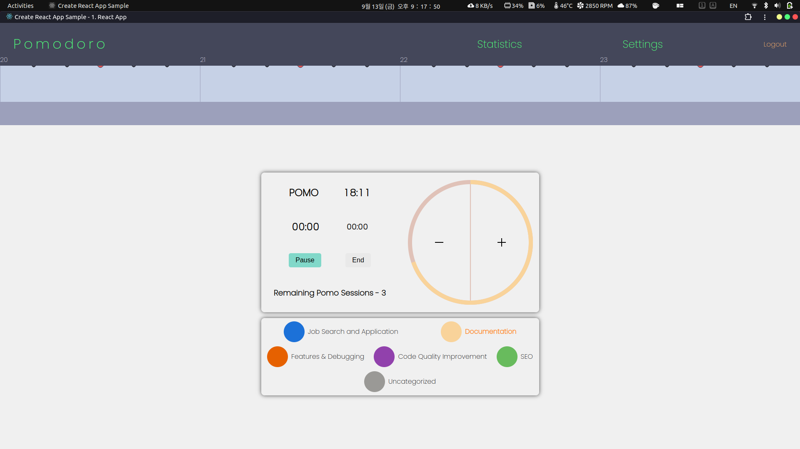

A session with two categories.
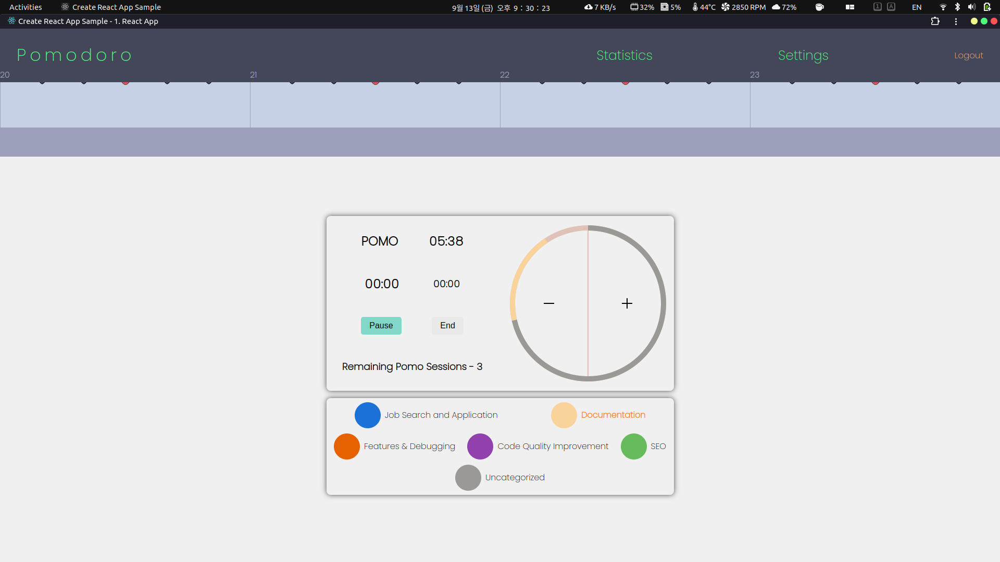

Timeline
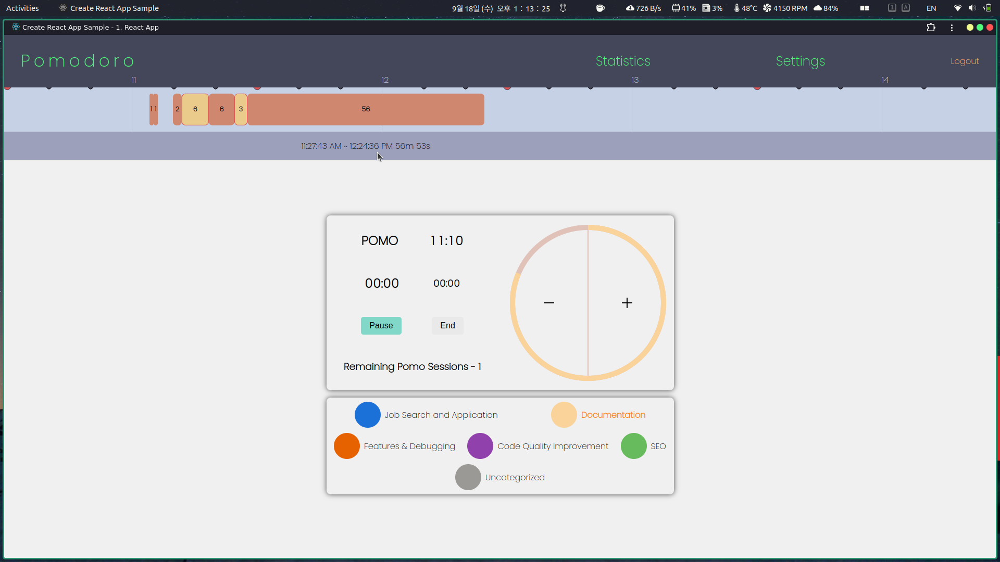

### `/statistics`

#### Total Graph and Category graph

`uncategorized` only in the second graph.
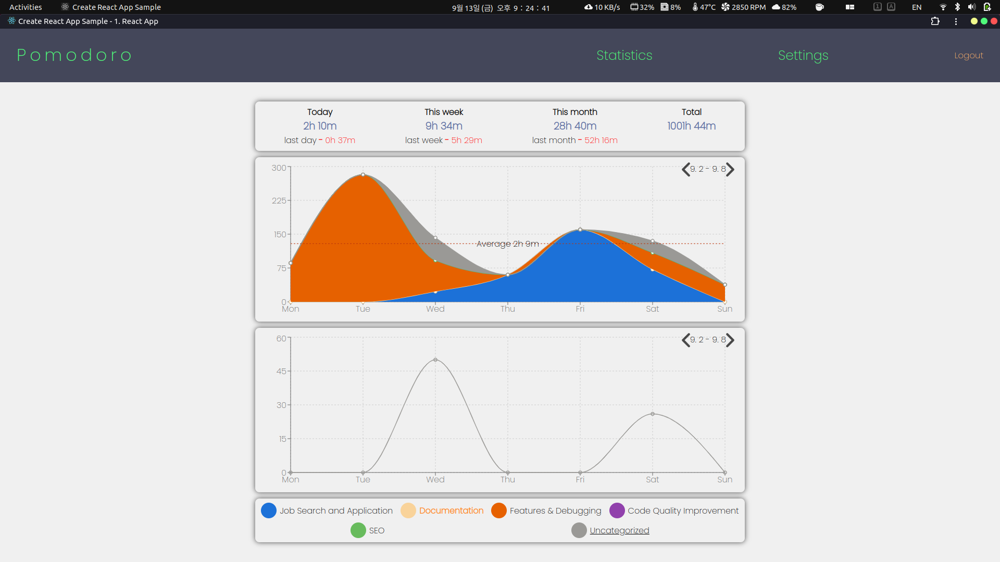

`Documentation` and `Features & Debugging` in the second graph.
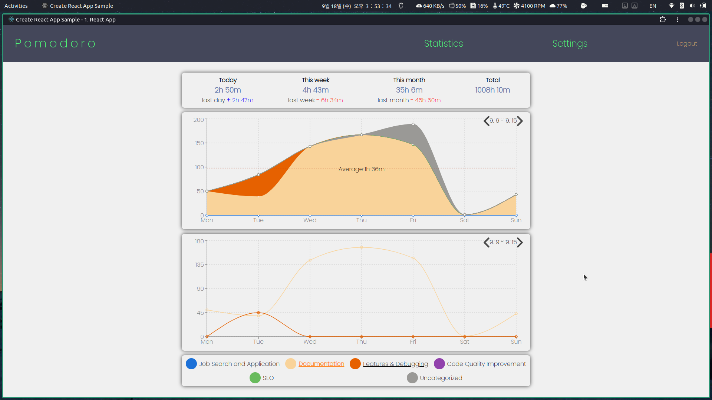

`uncategorized` and `Job Search and Application` in the second graph.

#### Two graphs show different week data

First - `9.9 ~ 9.15`, Second - `9.2 ~ 9.8`.
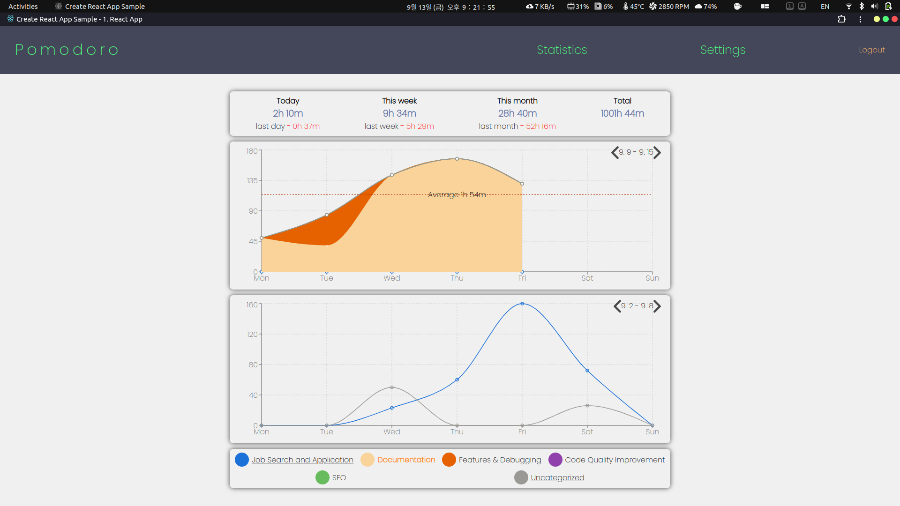

First - `9.2 ~ 9.8`, Second - `9.9 ~ 9.15`.
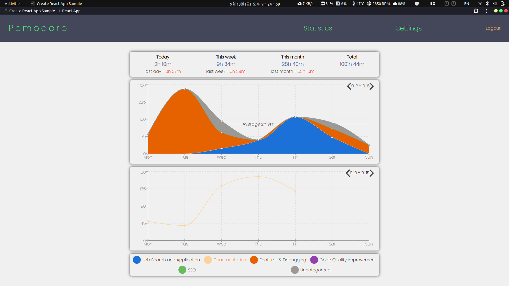

#### Mouse hover over each graph

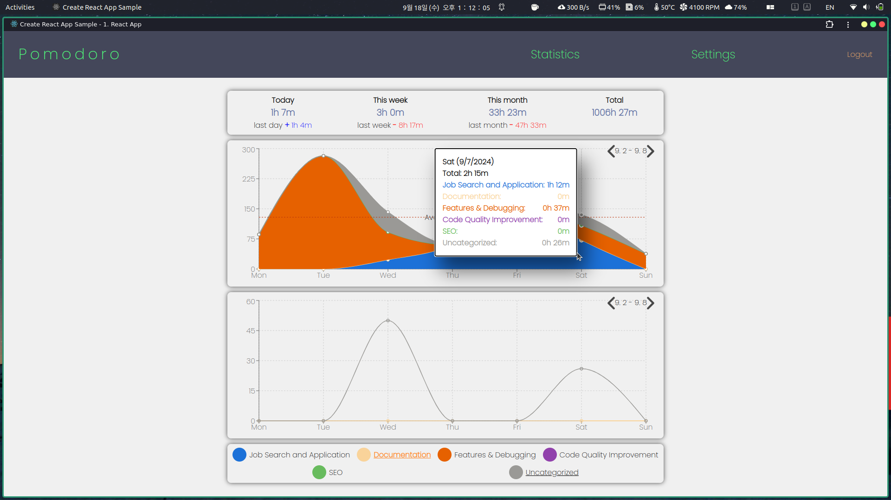

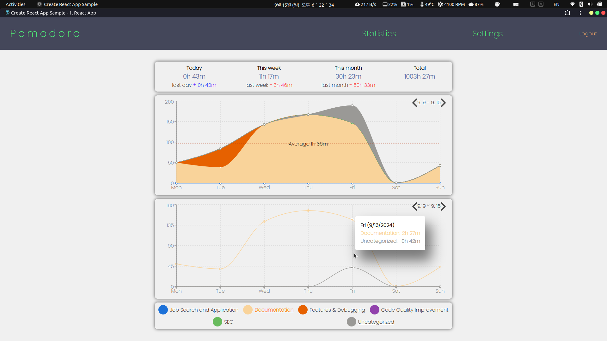

### `/settings`

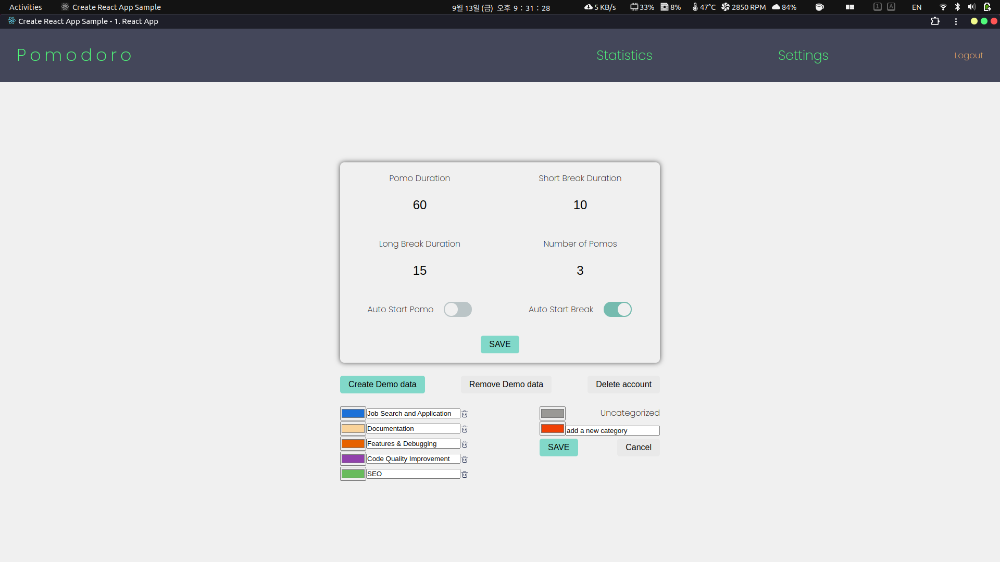

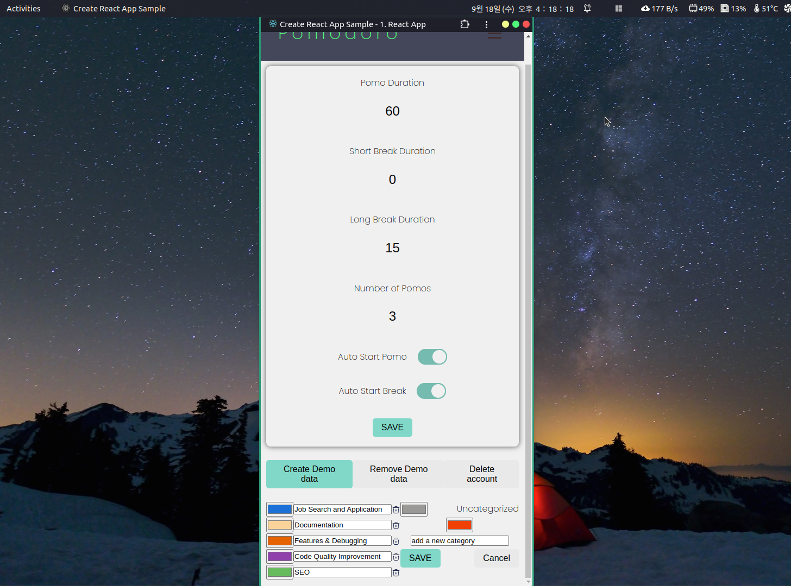
